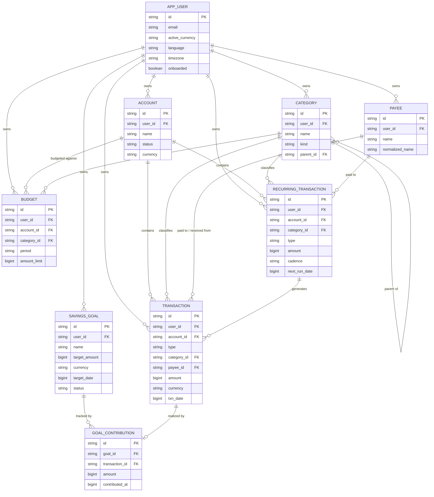
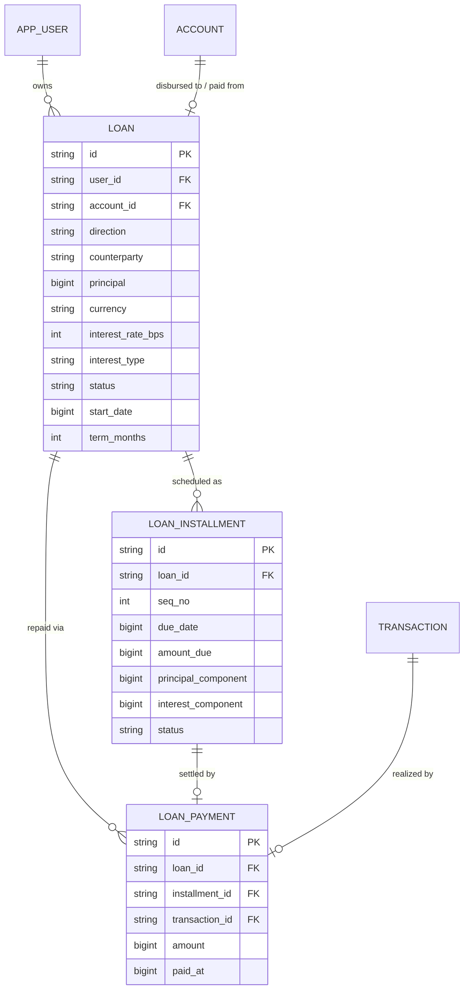
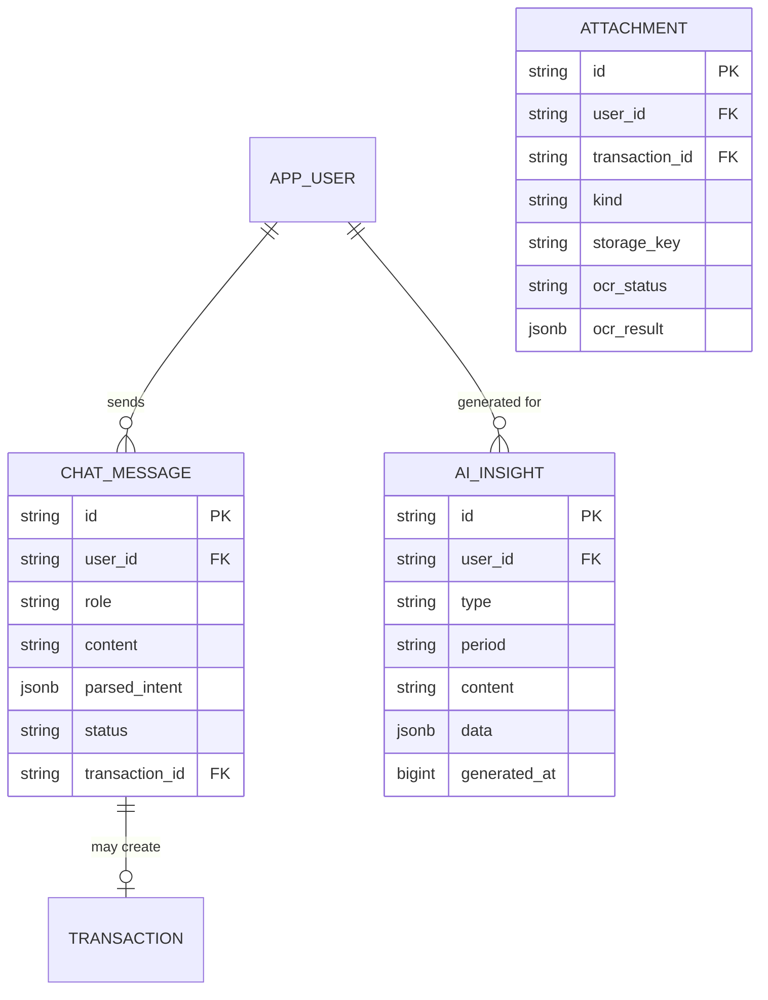
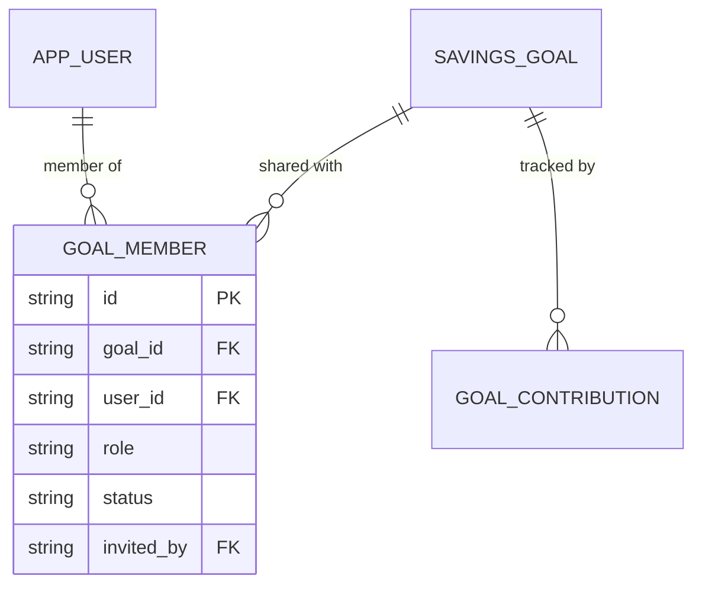
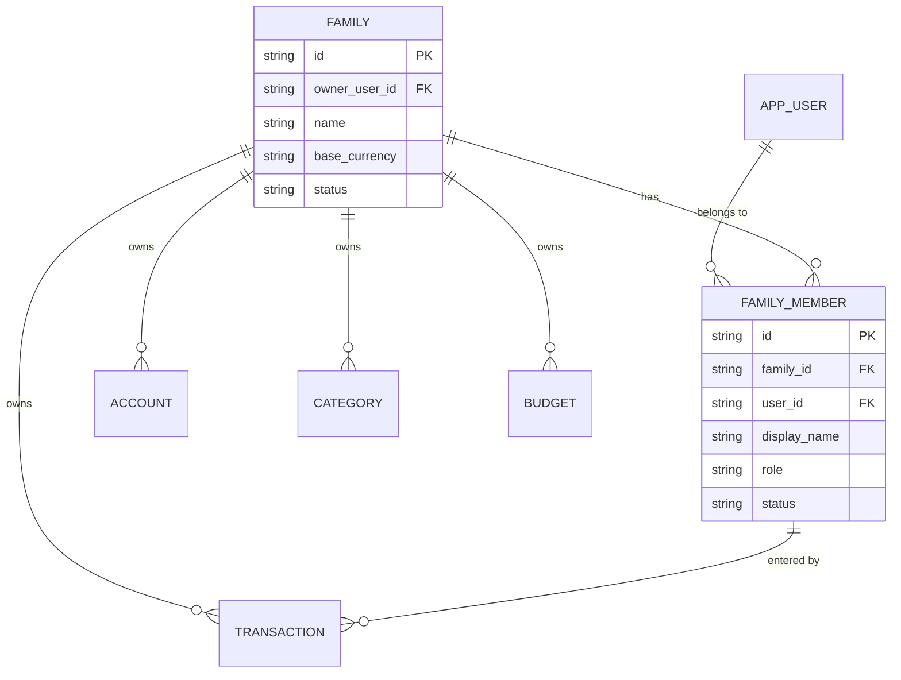
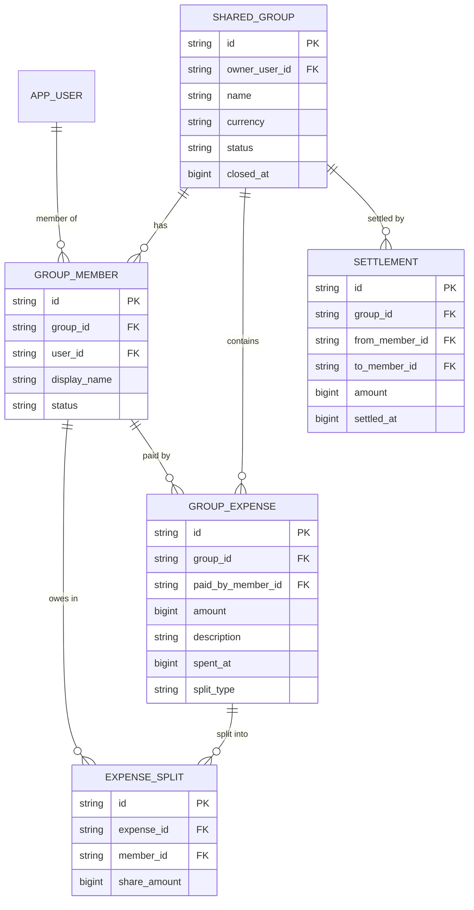

# Domain Documentation — ZenZ Money Manager

This is the **single source of truth** for the ZenZ Money Manager domain: the
entities, their fields, relationships, and the rules that govern them. It is the
basis for the database schema (`schema.md`) and the API design
(`../api/api-design.md`).

The finance domain replaces the legacy habit-tracker domain (`Habit`,
`HabitEntry`, `Reminder`). Auth and infrastructure (`app_user`, `user_roles`,
JWT, OAuth, Flyway, Redis) are kept unchanged — see
`../architecture/migration-plan.md`.

It complements the product-level [Features List](../features-list.md) and
[Roadmap](../roadmap.md); feature IDs (e.g. `F-1.11`) refer to those documents.
**Feature IDs were renumbered on 2026-08-08** to match BRD v1.0 — see the
[mapping table](../features-list.md#id-mapping-2026-08-08) when reading older
commits.

## Contents

- **Part 0 — [Foundations](#part-0--foundations)** — conventions, money, currency.
- **Part 1 — [Core Ledger](#part-1--core-ledger-mvp)** (MVP) — accounts, categories, transactions, budgets, recurring, the monthly position, access.
- **Part 2 — [Debts & Commitments](#part-2--debts--commitments-phase-3)** (Phase 3) — loans/EMI. *(Subscriptions folded into recurring, [§1.8](#18-recurringtransaction).)*
- **Part 3 — [Ingestion & AI](#part-3--ingestion--ai-mvp)** (MVP) — chat/NLP entry, voice, auto-categorization, OCR receipts, AI insights, financial assistant.
- **Part 4 — [Security](#part-4--security-mvp)** (MVP) — app lock, data protection.
- **Part 5 — [Sharing / Multi-user](#part-5--sharing--multi-user-phase-3)** (Phase 3) — family spaces, savings goals, shared goals, group expense sharing.
- **Part 6 — [Phasing & Traceability](#part-6--phasing--traceability)** — what ships when, schema/API mapping.

> ### The two rules that shape Part 1
>
> **No stored balance, and (since 2026-08-18) a user may hold more than one
> account.** An `Account` is auto-provisioned (unnamed) the first time it's
> needed, and the user may add, rename, list, and soft-delete more — but none has
> **any balance column at all** (F-1.1). The figure the user sees is the
> **monthly position**: income − expenses for one calendar month, computed on
> read across all the user's transactions regardless of account, and carried
> forward nowhere ([§1.10](#110-monthly-position-invariant)). Ledger writes still
> resolve one implicit account server-side — there is still no way to choose which
> account a transaction lands in, so there are still **no transfers**.
> Per-transaction account selection and transfers are the remaining, unscheduled
> slice of F-F.1 ([§1.4](#14-account)).

---

# Part 0 — Foundations

Every domain entity follows the conventions established by
`com.zenzmoney.common.domain.BaseEntity`.

## 0.1 Design conventions

| Convention | Rule |
|---|---|
| **Primary key** | `String id` — a UUID string (`VARCHAR(36)`), assigned in `BaseEntity.prePersist()` if unset. |
| **Ownership** | Every user-owned entity carries `user_id VARCHAR(36) NOT NULL`, indexed. Rows are always scoped to the authenticated user; no cross-user reads (until Part 5 sharing). |
| **Timestamps** | Epoch milliseconds stored as `BIGINT` (`created_time`, `modified_time`) via JPA auditing (`@CreatedDate` / `@LastModifiedDate`). Domain dates (e.g. `txn_date`) are also epoch-millis `BIGINT`. |
| **Audit** | `created_by` / `modified_by` (`VARCHAR(36)`) populated by JPA auditing. |
| **Concurrency** | Optimistic locking via `@Version` (`version BIGINT`). |
| **Enums** | Stored as `@Enumerated(EnumType.STRING)` in `VARCHAR(50)` columns. Enum types live in `common/domain`, mirroring the old `HabitStatus`. |
| **Free-form data** | Flexible attributes use a `jsonb` column mapped with `@JdbcTypeCode(SqlTypes.JSON)` (as `Habit.metadata` did). |

## 0.2 Money representation

**Amounts are stored as integer minor units in a `BIGINT` column, paired with an
ISO-4217 currency code.**

- `amount = 1050` with `currency = "USD"` means **$10.50**.
- Rationale: integer arithmetic avoids the rounding drift of floating-point
  money, and it is consistent with the codebase's existing "store time as
  epoch-millis `BIGINT`" style. No `DECIMAL`/`double` for money anywhere.
- The number of minor units per major unit is defined by the currency
  (2 for USD/EUR, 0 for JPY, 3 for BHD). Clients format for display; the backend
  only stores and sums minor units.
- Conversions between currencies are **not** performed implicitly. A report that
  spans currencies is either blocked (MVP) or carries an explicit `fx_rate`
  (future — F-F.2, see [Roadmap](../roadmap.md)).
- Interest rates are stored as **basis points** in an `int` (e.g. `750` = 7.50%),
  same no-float-drift principle (see [§2.2](#22-loan)).

## 0.3 One active currency per user

**In the MVP, each user operates in a single active currency at a time.** The
currency is a **user-level** setting, not a per-account choice (feature F-1.25):

- The user picks their active currency (`app_user.active_currency`, ISO-4217) at
  onboarding. Registration seeds a **provisional** one first, from the BCP-47
  `locale` the client reports — `si-LK` → `LKR` — so a user who skips onboarding
  is still usable; a client that reports nothing leaves it null rather than
  guessing. `app_user.onboarded` marks which of the two it is: while `false` the
  value is a guess that onboarding may replace, and once `true` the switch guard
  below applies.
- **Every** owned entity that stores money — `Account`, `Transaction`, `Budget`,
  `RecurringTransaction`, `SavingsGoal`, `Loan` — carries `currency`, and all rows
  for a user share the user's active currency. Storing it per row keeps the money
  representation self-contained and makes a future switch to true multi-currency a
  non-breaking change.
- **Switching** the active currency is allowed but guarded: because amounts are
  stored as minor units in the old currency, a switch means historical figures
  either stay in their original currency or get an explicit one-time conversion.
  The exact switch policy is a product decision tracked in the
  [Roadmap](../roadmap.md); the domain simply guarantees a single active currency
  is in force at any moment. (Note there is no *balance* to convert — the position
  is derived per month, [§1.10](#110-monthly-position-invariant).)
- Genuinely **mixing** currencies within one user, and cross-currency FX, are
  **out of scope** (future — F-F.2). The per-row `currency` column is the seam
  that makes that later work additive rather than a schema rewrite.

## 0.4 The `app_user` extensions

Beyond the existing auth columns, the domain adds these user-level fields:

| Field | Type | Notes | Introduced by |
|---|---|---|---|
| `activeCurrency` | `String(3)` | ISO-4217; the user's single active currency. | [§0.3](#03-one-active-currency-per-user) |
| `language` | `String(10)` | BCP-47 preferred language (e.g. `en`, `ta`, `si`). | F-1.26 |
| `timezone` | `String(50)` | IANA zone, default `UTC`. **Defines the calendar-month boundary** for the monthly position ([§1.10](#110-monthly-position-invariant)). | F-1.2 |
| `appLockEnabled` | `boolean` | Default `false`. | [§4.2](#42-app-lock-client-side) |
| `appLockTimeoutSeconds` | `int` | Auto-lock delay. Default `60`. | [§4.2](#42-app-lock-client-side) |
| `biometricEnabled` | `boolean` | Whether biometric unlock is allowed. Default `false`. | [§4.2](#42-app-lock-client-side) |

---

# Part 1 — Core Ledger (MVP)

This is the core personal ledger — the tables every other part builds on.

## 1.1 Entity overview

| Entity | Aggregate root | Purpose |
|---|---|---|
| `Account` | ✔ | A container for financial activity. A user may hold more than one, auto-created, balance-less. |
| `Category` | ✔ | A hierarchical label for income/expense classification. |
| `Payee` | ✔ | A named merchant/person a transaction is paid to or received from. |
| `Transaction` | ✔ | The core ledger record — income or expense. |
| `Budget` | ✔ | A spending cap for a category over a recurring period. |
| `RecurringTransaction` | ✔ | A template that generates future transactions on a cadence (including subscriptions). |
| `SavingsGoal` | ✔ | *(Phase 3, F-3.1)* A target amount funded by contributions over time. |
| `GoalContribution` | | *(Phase 3)* A funding event linking a goal to the transaction that moved the money. |

## 1.2 Entity Relationship Diagram



## 1.3 Enumerations

Defined in `com.<pkg>.common.domain` (replacing `HabitStatus`), stored as
`VARCHAR(50)` via `EnumType.STRING`.

```java
public enum AccountStatus    { ACTIVE, INACTIVE, DELETED }
public enum CategoryKind     { INCOME, EXPENSE }
public enum TransactionType  { INCOME, EXPENSE }
public enum BudgetPeriod     { MONTHLY, YEARLY }
public enum BudgetStatus     { ACTIVE, ARCHIVED, DELETED }
public enum RecurringCadence { DAILY, WEEKLY, MONTHLY, YEARLY }
public enum GoalStatus       { ACTIVE, ACHIEVED, ARCHIVED }
```

> **`AccountStatus` was restored on 2026-08-18** when the one-account rule was
> reversed — a user's accounts now have a lifecycle (delete is soft, via
> `DELETED`), which a single mandatory account never needed. `AccountType` is
> still gone, though: accounts have a `name` but are not typed (bank/cash/card/
> etc.) — that's still F-F.1 territory. `TransactionType.TRANSFER` is also still
> gone, since a transfer needs an explicit second account on the write path,
> which doesn't exist yet. `BudgetPeriod` dropped `WEEKLY` the same day, once
> budgets became calendar-aligned ([§1.7](#17-budget)) — a week doesn't nest
> inside a calendar month or year the way both remaining periods do.

## 1.4 Account

**A container for the user's financial activity.** One is created automatically
at onboarding; the user may add, rename, list, and soft-delete more (F-1.1,
carrying forward F-F.1's account-CRUD slice as of 2026-08-18). It is still
**balance-less** — see [§1.10](#110-monthly-position-invariant).

| Field | Type | Notes |
|---|---|---|
| `id` | `String` (UUID) | PK, from `BaseEntity`. |
| `userId` | `String` | Owner. Not null, indexed — **not unique** since a user may hold more than one account. |
| `name` | `String(100)` | Optional. An auto-provisioned account starts unnamed. |
| `status` | `AccountStatus` | `ACTIVE` / `INACTIVE` / `DELETED`. Default `ACTIVE`. |
| `currency` | `String(3)` | ISO-4217. Always equals the owner's `active_currency` ([§0.3](#03-one-active-currency-per-user)); stored here so a later multi-currency phase is additive. |
| `metadata` | `jsonb` | Free-form. |

**Rules**
- **Auto-provisioned.** The user's primary account — the oldest `ACTIVE` one — is get-or-created the first time it's needed: at onboarding (currency + language, F-1.27), or earlier on any read or ledger write once a currency exists, since registration seeds one.
- **A user may add more.** `POST /api/v1/account` creates another account in the caller's active currency, with an optional `name`; `PUT /api/v1/account/{id}/name` renames one; `GET /api/v1/account/active` lists the caller's `ACTIVE` accounts; `DELETE /api/v1/account/{id}` soft-deletes one (moves it to `DELETED`) and refuses if it is the caller's last `ACTIVE` account.
- **`DELETED` is soft.** The row is never removed — ledger rows and budgets still carry its `account_id`.
- **No balance columns.** There is no `openingBalance` and no `currentBalance`, so the user is never asked for a starting balance and no figure can drift out of step with the ledger. What replaces them is the monthly position ([§1.10](#110-monthly-position-invariant)), which sums across all the user's accounts regardless of which one a transaction is in.
- `currency` mirrors the owner's active currency; re-denominating is a user-level switch ([§0.3](#03-one-active-currency-per-user)). Because provisioning can precede onboarding, the primary account may already hold the *seeded* currency when the user picks a different one — onboarding moves it, and refuses once any transaction exists anywhere for the user.
- **The account is still implicit on every ledger write.** `Transaction.accountId` and `RecurringTransaction.accountId` are resolved server-side to the caller's primary account, never accepted from the client, and there is still no way to name a *different* one of the caller's accounts on a write. A client that could name an account could name someone else's — that constraint doesn't relax just because the caller now may have several.

> **What F-F.1 still hasn't shipped.** Per-transaction account selection and
> transfers between a user's own accounts. Both need the ledger write path to
> accept (and validate ownership of) an explicit `accountId` instead of resolving
> one implicitly — a bigger change than account CRUD, and not yet scheduled.

## 1.5 Category

A hierarchical label used to classify transactions. Owned by one user.

| Field | Type | Notes |
|---|---|---|
| `id` | `String` (UUID) | PK. |
| `userId` | `String` | Owner. Not null, indexed. |
| `name` | `String(200)` | Not null. |
| `kind` | `CategoryKind` | `INCOME` or `EXPENSE`. Not null. |
| `parentId` | `String` | Nullable. Self-reference for sub-categories. |
| `color` | `String(20)` | Optional. |
| `icon` | `String(50)` | Optional. |
| `sortOrder` | `int` | Default `0`. |

**Rules**
- Hierarchy is **one level deep**: a category with a `parentId` may not itself be a parent. Enforced in the service layer.
- A parent and its children must share the same `kind`.
- A category referenced by any transaction or budget cannot be deleted; it may be left unused.
- **Every** transaction carries a category — with `TRANSFER` gone, there is no category-less transaction type.
- **Seed categories.** At onboarding each new user is provisioned a default set so the app is not empty (F-1.27). Suggested defaults:
  - **Income** (`kind = INCOME`): Salary, Business, Freelance, Investments, Gifts.
  - **Expense** (`kind = EXPENSE`): Food & Drinks, Groceries, Transport, Housing, Utilities, Entertainment, Health, Shopping, Education, Subscriptions, Other.
  These are ordinary user-owned `Category` rows (fully editable/deletable), not a system table — seeding just copies a template into the user's own categories.

## 1.5b Payee

A named **merchant or person** a transaction is paid to (expense) or received from
(income). Owned by one user. Modeled as an entity — rather than a free-text string
on the transaction — so that payee is a **first-class filter/report dimension**
(F-1.9): "total spent at Keells", payee autocomplete, and dedup of
"Keells" / "keells" / "Keells Super" into one row.

| Field | Type | Notes |
|---|---|---|
| `id` | `String` (UUID) | PK. |
| `userId` | `String` | Owner. Not null, indexed. |
| `name` | `String(300)` | Display name as first entered, e.g. "Keells". Not null. |
| `normalizedName` | `String(300)` | Lower-cased/trimmed/whitespace-collapsed key for matching and uniqueness. Not null. |
| `color` | `String(20)` | Optional UI hint. |
| `icon` | `String(50)` | Optional UI hint. |

**Rules**
- **Uniqueness:** at most one payee per (`userId`, `normalizedName`) — enforced by a
  unique index. Resolving "Keells" and "keells" collapses to the same row.
- **Resolve-or-create:** every transaction-writing path (manual entry, chat/NLP
  capture F-1.11, voice F-1.12, OCR F-1.13) resolves a typed payee name to a
  `Payee` via a service (`resolveOrCreate`): normalize → find by (`userId`,
  `normalizedName`) → else create. Payees are never entered as opaque strings on
  the transaction.
- **Optional on a transaction:** unnamed one-off entries ("$5 for burger") have
  **no** payee (`payeeId` null). The item/description in such cases goes to the
  transaction's `note`, not to a payee.
- A payee referenced by any transaction cannot be hard-deleted; it may be left unused.
- Scoped by `user_id` like every owned entity (§1.12); no cross-user payees.

## 1.6 Transaction

The core ledger record. Every movement of money is one transaction row.

| Field | Type | Notes |
|---|---|---|
| `id` | `String` (UUID) | PK. |
| `userId` | `String` | Owner. Not null, indexed. |
| `accountId` | `String` | FK → `account`. Not null. **Resolved server-side** to the caller's primary account ([§1.4](#14-account)) — never sent by the client, and not yet choosable even though the caller may hold more than one account. |
| `type` | `TransactionType` | `INCOME` / `EXPENSE`. Not null. |
| `categoryId` | `String` | FK → `category`. Required — every transaction is categorized. |
| `amount` | `long` | Minor units. **Always positive**; sign is derived from `type`. Not null. |
| `currency` | `String(3)` | ISO-4217. Equals the owner's active currency ([§0.3](#03-one-active-currency-per-user)) and therefore the account currency. |
| `txnDate` | `long` | Epoch millis of the transaction date. Not null, indexed. **Decides which month the row counts in** ([§1.10](#110-monthly-position-invariant)). |
| `payeeId` | `String` | Optional FK → `payee` ([§1.5b](#15b-payee)). The merchant/payer as an entity, not free text. Null for unnamed one-off entries. Indexed (drives payee filtering, F-1.9). |
| `note` | `String(500)` | Optional free-text description / item (e.g. "burger", "tea things"). |
| `tags` | `jsonb` | Optional string array. |
| `recurringId` | `String` | Nullable FK → `recurring_transaction` if auto-generated. |

**Rules**
- `amount` is stored as a positive magnitude. Effect on the monthly position is determined by `type`: INCOME adds, EXPENSE subtracts.
- Every transaction **requires** a `categoryId` whose `kind` matches its `type` (INCOME→INCOME, EXPENSE→EXPENSE).
- **There is no `TRANSFER`.** A transfer moves money between two accounts the client picks, and the write path still resolves only one account implicitly ([§1.4](#14-account)), so the type, the `transferAccountId` column, and the "destination account" validation are all gone. This returns with the rest of F-F.1.
- Creating, editing, or deleting a transaction changes **only the position of the month its `txnDate` falls in** ([§1.10](#110-monthly-position-invariant)). Nothing is written back to the account. Moving a transaction's date *across* a month boundary changes two months' positions — both are simply recomputed on next read.
- **Receipt images are not stored** — scanning (F-1.13) extracts merchant/date/total into an ordinary transaction and the image is discarded. There is no `Attachment` entity.
- **Search & filter** (F-1.9) over transactions (keyword, date range, category, amount, payee, tags) is a first-class MVP capability; the indexed `txnDate`, `userId`, `categoryId`, and `payeeId` columns support it. Payee filtering is by `payeeId` ([§1.5b](#15b-payee)), not free-text match.

## 1.7 Budget

A spending cap for a category (or overall) on a specific account, for one named
calendar period. **Linked to an account since 2026-08-18** — a budget no longer
stores its own currency or an anchor date; both changed because a budget now
belongs to one of the user's (possibly several) accounts. **Per-period since
2026-08-20** — each row names the month or year it applies to (`periodKey`).

| Field | Type | Notes |
|---|---|---|
| `id` | `String` (UUID) | PK. |
| `userId` | `String` | Owner. Not null, indexed. |
| `accountId` | `String` | FK → `account`. Not null — every budget targets one specific account. |
| `categoryId` | `String` | FK → `category`. Nullable ⇒ overall budget. |
| `period` | `BudgetPeriod` | `MONTHLY` / `YEARLY`. Not null. |
| `periodKey` | `String(7)` | The one period this cap applies to — `yyyy-MM` for MONTHLY, `yyyy` for YEARLY. Not null. |
| `amountLimit` | `long` | Minor units cap for the period. Not null. |
| `rollover` | `boolean` | Carry unused amount into the next period. Default `false`. |
| `status` | `BudgetStatus` | `ACTIVE` / `ARCHIVED` / `DELETED`. Delete is soft. |

**Rules**
- A budget's `categoryId` (if set) must be an `EXPENSE` category; its `accountId` must be one of the caller's own, and not `DELETED` ([§1.4](#14-account)).
- At most one active budget per (`accountId`, `categoryId`, `period`, `periodKey`) — a user may run the same category on two different accounts, and the same category in two different months. Backed by the partial unique index `uq_budget_active_slot` (`V5`), which folds a null `categoryId` to `''` because Postgres 14 treats nulls as distinct in a unique index.
- **Currency is derived, not stored** — a budget's currency is its linked account's `currency`, read at request time. (In the MVP, every account still shares the user's one active currency ([§0.3](#03-one-active-currency-per-user)), so this is only observably different once accounts can diverge, future work under F-F.2.)
- **A budget names its own period; nothing is ongoing.** `periodKey` is the month or year the cap belongs to, so Food may be 200000 for `2026-07` and 300000 for `2026-08` as two rows. Changed on 2026-08-20, replacing a single row that applied to "whatever period is current": that model could not express a one-month change, and a cap created in May was silently claiming January. There is deliberately no "every month" row — a budget the user never set for a month does not exist for that month.
- **Spend is scoped to the budget's own account.** A budget targets one account, so its `spent` counts only that account's EXPENSE rows; the same category budgeted on two accounts reports two different figures.
- **Periods are calendar-aligned, computed in the owner's timezone** (`app_user.timezone`, same rule as [§1.10](#110-monthly-position-invariant)) — a `MONTHLY` budget's window is the calendar month its `periodKey` names, a `YEARLY` budget's is that calendar year, boundaries resolved fresh on every read so a user who moves timezone gets their own midnight. There is no anchor date: `startDate` was dropped along with the arbitrary-cycle model it supported (a monthly budget started mid-month used to run mid-month to mid-month; it no longer can).
- "Spent" is computed from EXPENSE transactions in the budget's own period window; budgets store the cap, not the running total.
- **Rollover is a budget-only concept**, and is stored but **not yet applied** — `remaining` is `amountLimit − spent` today. A budget may carry unused headroom into the next period; the monthly position never does. The two are not inconsistent — a budget is a plan the user sets, the position is a fact about what happened (OQ-3).
- **Delete is soft** (`status` → `DELETED`, added 2026-08-20) — the row survives so "what did I plan last March" stays answerable, and because a budget references nothing, keeping it costs nothing. A `DELETED` budget appears in no listing and cannot be edited or archived; it is still readable by id. `ARCHIVED` and `DELETED` differ in intent, not mechanism: archived is a plan deliberately retired and still worth seeing, deleted is a mistake taken off the screen. Both free the (`accountId`, `categoryId`, `period`, `periodKey`) slot, because only `ACTIVE` rows compete for it.
- Budget usage feeds alerts (F-1.20), e.g. *"You've used 90% of your Food budget."*

## 1.8 RecurringTransaction

A template that generates `Transaction` rows on a schedule. **One model for
everything that repeats** (F-1.7): income (*salary $3000 on the 25th monthly*),
expense (rent, utilities), **and subscriptions** (Netflix, Spotify, gym) — a
subscription is a recurring expense with a renewal date, not a separate entity.

| Field | Type | Notes |
|---|---|---|
| `id` | `String` (UUID) | PK. |
| `userId` | `String` | Owner. Not null, indexed. |
| `accountId` | `String` | FK → `account`. Not null. Resolved server-side ([§1.4](#14-account)). |
| `categoryId` | `String` | FK → `category`. Required; `kind` must match `type`. |
| `type` | `TransactionType` | `INCOME` / `EXPENSE`. Not null. |
| `amount` | `long` | Minor units, positive. Not null. The subscription's cost. |
| `currency` | `String(3)` | ISO-4217. |
| `cadence` | `RecurringCadence` | Not null. The repeat / billing frequency. |
| `nextRunDate` | `long` | Epoch millis of the next generation — the next due or renewal date. Not null, indexed. |
| `trialEndDate` | `long` | Nullable. Free-trial end, for the trial-expiry reminder (F-1.7 / F-1.20). |
| `endDate` | `long` | Nullable; stop generating after this. |
| `active` | `boolean` | Default `true`. |
| `payeeId` | `String` | Optional FK → `payee` ([§1.5b](#15b-payee)). Copied onto generated transactions. |
| `note` | `String(500)` | Copied onto generated transactions. |

**Rules**
- A scheduled job scans `active = true AND next_run_date <= now`, creates a `Transaction` (with `recurringId` set back to the template), then advances `nextRunDate` by the cadence.
- The same validation as `Transaction` applies to the generated row — including "no TRANSFER templates".
- A generated row lands in the month its run date falls in, so it counts toward exactly that month's position ([§1.10](#110-monthly-position-invariant)).
- Reaching `endDate` sets `active = false`.
- **Reminders** (F-1.20) read this table: upcoming `nextRunDate` drives bill and renewal reminders, and `trialEndDate` drives the trial-expiry warning.

## 1.9 SavingsGoal & GoalContribution

> **Phase 3 (F-3.1), documented here.** Savings goals moved out of the MVP in BRD
> v1.0. The backend below is **already built** — it stays as-is rather than being
> deleted, since Phase 3 commits to it (OQ-7). It is documented in Part 1 because
> it sits on the core ledger, not on the sharing model.

A **SavingsGoal** is a target the user is saving toward. Progress is measured by
recorded contributions, so the goal can never diverge from what the user actually
put aside. Personal and single-owner here; its shared form (`GoalMember`) is
[§5.2](#52-shared-savings-goals-goalmember).

### SavingsGoal

| Field | Type | Notes |
|---|---|---|
| `id` | `String` (UUID) | PK. |
| `userId` | `String` | Owner. Not null, indexed. |
| `name` | `String(300)` | e.g. "Japan Trip". Not null. |
| `targetAmount` | `long` | Minor units. Not null. |
| `currency` | `String(3)` | ISO-4217. Equals the owner's active currency. |
| `targetDate` | `long` | Epoch millis; nullable soft deadline. |
| `status` | `GoalStatus` | `ACTIVE` / `ACHIEVED` / `ARCHIVED`. Default `ACTIVE`. |
| `color` / `icon` | `String` | Optional UI hints. |

**Progress is derived, not stored:**

```
saved     = Σ GOAL_CONTRIBUTION.amount for this goal
progress  = saved / target_amount
remaining = max(0, target_amount - saved)
```

`status` flips to `ACHIEVED` when `saved >= target_amount` (service layer, on each contribution). A goal never holds a phantom balance.

### GoalContribution

A single funding event, optionally linked to the `Transaction` that moved the money.

| Field | Type | Notes |
|---|---|---|
| `id` | `String` (UUID) | PK. |
| `goalId` | `String` | FK → `savings_goal`. Not null, indexed. |
| `transactionId` | `String` | FK → `transaction`. Nullable for a manual/adjustment entry. |
| `amount` | `long` | Minor units, positive. Not null. |
| `contributedAt` | `long` | Epoch millis. Not null. |
| `note` | `String(500)` | Optional. |

**Rules**
- A contribution's `amount`/`currency` must match its linked transaction.
- Deleting the linked transaction deletes (or voids) the contribution.
- Contributions are additive; a "withdrawal" is recorded as a reversing contribution, so `saved` always reflects the earmarked total.
- The contributing user is the goal owner; the shared form adds a `userId` per contribution to attribute members ([§5.2](#52-shared-savings-goals-goalmember)).

## 1.10 Monthly position (invariant)

**There is no balance anywhere in this domain — not stored, not accumulated, not
carried forward.** The single figure the product shows is the **monthly
position** (F-1.2), computed on read for **one calendar month**:

```
income(m)   = Σ(amount) where type = INCOME  and txn_date ∈ [start(m), start(m+1))
expenses(m) = Σ(amount) where type = EXPENSE and txn_date ∈ [start(m), start(m+1))
position(m) = income(m) − expenses(m)
```

- **The window is half-open** `[start, next_start)`, so a transaction at the exact instant a month begins belongs to the new month and is never counted twice.
- **Boundaries are resolved in `app_user.timezone`** (default `UTC`) and then converted to epoch millis. A user in `Asia/Colombo` gets Colombo months; changing the timezone re-slices every month on the next read, because nothing was precomputed (OQ-2).
- **Nothing carries forward.** `position(August)` does not seed September. There is no opening figure, no closing figure, no cumulative running total, and consequently no "reset".
- **Any month is computable** — past months are the same query with a different window.
- **A write only affects its own month.** Creating / editing / deleting a transaction changes the position of the month its `txnDate` falls in, and no other. Moving a date across a boundary affects exactly the two months involved.
- Spending analysis (F-1.18), reports (F-1.19), and the dashboard (F-1.17) all use **this** window rule, so every month-labelled figure on screen agrees with every other.
- **Budgets follow the same calendar-alignment rule** ([§1.7](#17-budget)) — a `MONTHLY` budget's window is the calendar month its `periodKey` names, `YEARLY` that calendar year, both resolved in the *account owner's* timezone exactly like the position above. This changed on 2026-08-18: budgets previously anchored to an arbitrary `startDate` and rolled every period from there, so a monthly budget started mid-month wasn't a calendar month; that flexibility was traded away for a simpler, always-calendar-aligned model, and `startDate` was dropped.

> **Why derived rather than stored.** A stored balance has to be maintained on
> every write, which means it can be wrong — the classic reconciliation bug this
> product now avoids by construction. A figure recomputed from the ledger on every
> read cannot drift from the ledger, so there is nothing to reconcile
> ([out of scope](../features-list.md#out-of-scope)) and no recompute job to run.
> The cost is a `SUM` per read, over an indexed `(user_id, txn_date)` range —
> cheap at personal-finance volumes, and revisit it with a cache only if a real
> measurement says so.

> **What disappeared with the stored balance:** the `opening_balance` /
> `current_balance` columns, the re-derivation on every ledger write, balance
> reconciliation (F-1.2b), and **net worth** — which summed account balances and
> loan outstandings, and has no meaning without balances. The dashboard (F-1.17)
> shows income, expenses, and position (see OQ-1).

## 1.12 Ownership & access (MVP)

Every query is scoped by `user_id` from the JWT principal, exactly as the habit
domain scoped by `user_id`. There is no sharing between users in the MVP.
`ROLE_ADMIN` may read aggregate/system data but does not bypass per-user
transaction scoping. See the existing role guide for how `@RolesAllowed` and the
JWT filter enforce this. (Part 5 sharing replaces this with membership-based
access for shared entities only.)

---

# Part 2 — Debts & Commitments (Phase 3)

> **Moved MVP → Phase 3 (F-3.2)** in BRD v1.0, and **not implemented** — no
> entities, tables, or services exist for any of Part 2. The design below is kept
> as the spec to build against when Phase 3 starts. **Subscription tracking left
> this part entirely**: it is now a recurring transaction with a renewal date and
> a trial-end date ([§1.8](#18-recurringtransaction), F-1.7), not its own entity.

Models **money the user is committed to over time**, layered on the core ledger.
**Design principle — reuse the ledger, don't shadow it:** a debt is a *plan*; the
actual money movements are ordinary `Transaction`s linked back to the plan, so
reports stay correct without a parallel ledger.

## 2.1 Debts & Loans — concept

A **Loan** (F-3.2) is a debt agreement with a principal, an interest rate, and a
repayment schedule of **installments** (EMIs). It covers both directions:

- **Borrowing** (`BORROWED`) — the user owes someone (home/car loan, money from a friend). A liability.
- **Lending** (`LENT`) — someone owes the user. A receivable.

Each scheduled installment is a `LoanInstallment`; each real repayment is a
`Transaction` linked via `LoanPayment`, so the outstanding figure is always
reconciled with the ledger rather than tracked separately.

> **`Loan.accountId` is vestigial under the single-account model.** With one
> account per user it can only ever hold that account's id; treat it as reserved
> for F-F.1 and resolve it server-side, exactly like `Transaction.accountId`
> ([§1.4](#14-account)).



```java
public enum LoanDirection     { BORROWED, LENT }
public enum InterestType      { NONE, FLAT, REDUCING }
public enum LoanStatus        { ACTIVE, CLOSED, DEFAULTED, ARCHIVED }
public enum InstallmentStatus { DUE, PAID, PARTIAL, OVERDUE }
```

## 2.2 Loan

| Field | Type | Notes |
|---|---|---|
| `id` | `String` (UUID) | PK. |
| `userId` | `String` | Owner. Not null, indexed. |
| `accountId` | `String` | FK → `account` money is disbursed to (BORROWED) or paid from (LENT). Nullable if untracked. |
| `direction` | `LoanDirection` | `BORROWED` / `LENT`. Not null. |
| `name` | `String(300)` | e.g. "Car Loan". Not null. |
| `counterparty` | `String(300)` | Lender/borrower name (bank, friend). Optional. |
| `principal` | `long` | Original amount in minor units. Not null. |
| `currency` | `String(3)` | ISO-4217; the user's active currency. |
| `interestRateBps` | `int` | Annual interest rate in **basis points** (e.g. 750 = 7.50%). `0` for interest-free. |
| `interestType` | `InterestType` | `FLAT` / `REDUCING` / `NONE`. Not null. |
| `startDate` | `long` | Epoch millis when the loan starts. Not null. |
| `termMonths` | `int` | Number of installments. Nullable for open-ended. |
| `status` | `LoanStatus` | `ACTIVE` / `CLOSED` / `DEFAULTED` / `ARCHIVED`. Default `ACTIVE`. |
| `note` | `String(500)` | Optional. |

**Derived values (not stored):**

```
outstanding = Σ LOAN_INSTALLMENT.principal_component (unpaid)
paid_total  = Σ LOAN_PAYMENT.amount
next_due    = earliest LOAN_INSTALLMENT with status = DUE
```

**Rules**
- `status` flips to `CLOSED` when every installment is `PAID`.
- A `BORROWED` loan is a liability, a `LENT` loan a receivable. Neither feeds a net-worth figure — that concept went away with stored balances ([§1.10](#110-monthly-position-invariant)).
- Interest is computed by the service layer from `interestType` + `interestRateBps` when the schedule is generated; the domain stores the resulting per-installment components, not a running formula.

## 2.3 LoanInstallment (EMI schedule)

One row per scheduled payment. Generated when the loan is created (regenerated if
terms change), splitting each EMI into principal + interest.

| Field | Type | Notes |
|---|---|---|
| `id` | `String` (UUID) | PK. |
| `loanId` | `String` | FK → `loan`. Not null, indexed. |
| `seqNo` | `int` | 1-based installment number. |
| `dueDate` | `long` | Epoch millis. Not null, indexed. |
| `amountDue` | `long` | Total EMI for this period (principal + interest). |
| `principalComponent` | `long` | Portion reducing principal. |
| `interestComponent` | `long` | Portion that is interest. |
| `status` | `InstallmentStatus` | `DUE` / `PAID` / `PARTIAL` / `OVERDUE`. Default `DUE`. |

**Rules**
- `amountDue = principalComponent + interestComponent` for every row.
- `Σ principalComponent` across all installments = `Loan.principal` (rounding remainders distributed deterministically).
- Marked `OVERDUE` by a scheduled job when `due_date < now` and not `PAID`; feeds reminders (F-1.20).

## 2.4 LoanPayment

Links a real repayment `Transaction` to the loan (and optionally the installment
it settles).

| Field | Type | Notes |
|---|---|---|
| `id` | `String` (UUID) | PK. |
| `loanId` | `String` | FK → `loan`. Not null, indexed. |
| `installmentId` | `String` | FK → `loan_installment`. Nullable (a lump-sum prepayment may span several). |
| `transactionId` | `String` | FK → `transaction` (EXPENSE for BORROWED, INCOME for LENT). Not null. |
| `amount` | `long` | Minor units. Must match the linked transaction. |
| `paidAt` | `long` | Epoch millis. |

**Rules**
- Recording a payment updates the target installment(s) to `PAID`/`PARTIAL`.
- Deleting the linked transaction voids the payment and reopens the installment.
- A **payoff plan** is a derived projection (service layer): given `outstanding`, rate, and a chosen extra-payment amount, project the revised payoff date and interest saved. No stored entity. (Multi-debt strategies like snowball/avalanche are future work, F-F.6.)

## 2.5 Subscription tracking — merged into recurring

**There is no `Subscription` entity.** BRD v1.0 folds subscriptions into
recurring income/expenses (F-1.7): a subscription *is* a recurring expense with a
billing cycle, a renewal date, and an optional free-trial end date — all of which
`RecurringTransaction` already carries ([§1.8](#18-recurringtransaction)).

| What the old design had | Where it lives now |
|---|---|
| `name` / `provider` | The template's [`Payee`](#15b-payee) (*Netflix*) plus its `note`. |
| `amount`, `currency`, `billingCycle` | `RecurringTransaction.amount` / `currency` / `cadence`. |
| `nextRenewalDate` | `RecurringTransaction.nextRunDate`. |
| `trialEndDate` | `RecurringTransaction.trialEndDate`. |
| `status` (`ACTIVE`/`PAUSED`/`CANCELLED`) | `RecurringTransaction.active` + `endDate`. |
| `recurringId` link | Not needed — it *is* the recurring row. |

**Why merge.** The two models were the same shape, and the split forced every
consumer (reminders, reports, "what do I pay monthly") to read two tables and
de-duplicate charges that the recurring engine had already posted. One table
cannot double-count.

> **Not app billing.** This is about subscriptions the user pays to *third
> parties*. The user's own ZenZ Free/Premium plan (F-2.1) is app monetization and
> unrelated.

- Reminders (renewal soon, trial ending) are emitted by the notification system (F-1.20) keyed off `nextRunDate` / `trialEndDate`.
- Total monthly subscription cost is a derived aggregate over active EXPENSE templates.

---

# Part 3 — Ingestion & AI (MVP)

The **intelligent input and insight** side of the domain: how transactions get
created from natural language, voice, and scanned receipts, and how AI insights
are produced. Everything here ultimately produces or reads the `Transaction` rows
of [Part 1](#part-1--core-ledger-mvp).

The design principle is a single funnel: **every capture channel — typed chat,
voice, or a scanned receipt — is normalized into a proposed transaction, which the
user confirms before it enters the ledger.**

> **Phase.** All of it is **MVP** in BRD v1.0 — chat entry (F-1.11), voice entry
> (F-1.12, promoted from Phase 2), receipt scanning (F-1.13), auto-categorization
> (F-1.14), insights (F-1.15), and the financial assistant (F-1.16). Only the
> *advanced* assistant — follow-ups, comparisons, forecasts (F-2.2) — is Phase 2.

## 3.1 The capture pipeline


| Channel | Raw input | Extraction step | Feature |
|---|---|---|---|
| Chat | Text message | NLP intent + entity parse | F-1.11 |
| Voice | Audio clip | Speech-to-text → same NLP parse | F-1.12 |
| Receipt | Image / PDF | OCR → field extraction → NLP normalize | F-1.13 |

**The account is never part of a capture.** A draft carries type, amount,
category, date, payee, and note; the account is resolved server-side at confirm
time ([§1.4](#14-account)), so no capture channel can name one.

The output of all three is a **ParsedIntent** ([§3.3](#33-parsedintent-value-object)), rendered as a draft transaction for confirmation.

## 3.2 Entity overview

| Entity | Aggregate root | Purpose |
|---|---|---|
| `ChatMessage` | ✔ | A logged user/assistant message in the conversational interface. |
| `AiInsight` | ✔ | A generated insight/report snippet derived from the user's ledger. |

`ParsedIntent` is a **transient value object** — the structured result of
interpreting one input — stored inline (as `jsonb`) on the `ChatMessage`.

> **No `Attachment` entity.** Receipt images are [out of scope](../features-list.md#out-of-scope):
> scanning (F-1.13) extracts merchant / date / total, produces a draft, and the
> image is discarded — see [§3.5](#35-receipt-scanning-ocr).



## 3.3 ParsedIntent (value object)

The normalized interpretation of a single input. Not a table of its own; stored
inline (`jsonb`) on the message/attachment that produced it.

| Field | Type | Notes |
|---|---|---|
| `intent` | `IntentType` | What the user is trying to do. |
| `txnType` | `TransactionType` | Inferred `INCOME` / `EXPENSE`. |
| `amount` | `long` | Minor units, in the user's active currency. |
| `categoryId` | `String` | Best-match category; null if unresolved. |
| `categoryName` | `String` | The matched category's name, snapshotted so a draft preview renders without a second lookup. Null until `categoryId` resolves. |
| `categoryGuess` | `String` | Raw label the model proposed (e.g. "food") before matching. |
| `accountId` | `String` | Target account; defaults to the user's default account. |
| `txnDate` | `long` | Resolved date ("yesterday" → epoch millis). Defaults to now. |
| `payeeName` | `String` | Optional merchant/payer **name** as extracted. Stays a name at the draft stage; resolved to a `payee` row ([§1.5b](#15b-payee)) via resolve-or-create only when the draft is confirmed. |
| `note` | `String` | Optional free-text description / item (e.g. "burger", "tea things"). |
| `confidence` | `double` | 0–1 model confidence; drives the confirm-vs-clarify branch. |
| `missingFields` | `string[]` | Fields the parser could not fill (prompts clarification). |
| `rawInput` | `String` | The original text/transcript for auditing. |

**Resolution rules**
- **Currency is never parsed from the message.** The amount is always interpreted in the user's single active currency ([§0.3](#03-one-active-currency-per-user)); a "$" or "€" in text is a magnitude marker, not a currency switch.
- **Auto-category detection (F-1.14):** category matching resolves `categoryGuess` against the user's categories (case-insensitive, synonym/alias aware, language-aware). The parser infers a category (and sub-category) from merchant/keywords — *"Spent $15 at Starbucks"* → **Food & Drinks → Coffee** — and the user can **correct** the suggestion, which is fed back as a preference for future matching. If no match and confidence is high, the UI may offer to **create** the category.
- Relative dates ("today", "yesterday", "last Friday") resolve against the user's timezone.
- If `confidence < threshold` or `missingFields` is non-empty, the assistant asks a clarifying question instead of proposing a transaction.
- **A conversation refines one draft.** When a message arrives on a session whose last assistant turn is still open, each field is filled from the freshest source that has one — what the model just read, then the message read as a bare answer ("20", "Food"), then the open draft. So "I spent $20" followed by "Food" is one transaction, not two half-empty ones. An answered question narrows uncertainty, so the merged `confidence` is the higher of the two; a message the model reads as a *different* intent is believed and leaves the open draft alone.
- **One question at a time, most blocking first** — amount, then direction, then category. The category list to offer depends on the direction, so the direction cannot be asked second. Only fields the user can answer are asked about: an unset `currency` needs onboarding, not a reply.

```java
public enum IntentType {
    CREATE_TRANSACTION,   // "I spent $20 on food"
    UPDATE_TRANSACTION,   // "change that to $25"
    QUERY,                // "how much did I spend on food this month?"
    UNKNOWN               // fallback → ask to clarify
}
```

## 3.4 ChatMessage

The log of the conversational interface. Both user and assistant messages are
stored, so a conversation replays and a created transaction traces back to its
message.

| Field | Type | Notes |
|---|---|---|
| `id` | `String` (UUID) | PK. |
| `userId` | `String` | Owner. Not null, indexed. |
| `role` | `ChatRole` | `USER` or `ASSISTANT`. Not null. |
| `content` | `String` (text) | The message text (or transcript for voice). |
| `language` | `String(10)` | BCP-47 tag detected/selected (e.g. `en`, `ta`, `si`). |
| `parsedIntent` | `jsonb` | The `ParsedIntent` for interpreted user messages. Nullable. |
| `status` | `ChatMessageStatus` | Lifecycle of the interpretation. |
| `transactionId` | `String` | FK → `transaction` once a message creates/updates one. Nullable. |
| `sessionId` | `String` | Groups messages into a conversation thread. |

```java
public enum ChatRole          { USER, ASSISTANT }
public enum ChatMessageStatus { RECEIVED, PARSED, NEEDS_CLARIFICATION, CONFIRMED, REJECTED, SUPERSEDED, ANSWERED, FAILED }
```

**Rules**
- A `USER` message with `intent = CREATE_TRANSACTION` and sufficient confidence produces a **draft**; the transaction is only written after the user confirms, at which point `status = CONFIRMED` and `transactionId` is set.
- **At most one confirmable draft per session.** Taking a draft further with a new message moves the turn it grew out of to `SUPERSEDED`, which is terminal — otherwise "actually make that 30" would leave the 20 still confirmable and a client holding the old id could commit it. A turn is *not* superseded when the model was unreachable or the user changed the subject: an outage must not cost someone the capture they had in progress.
- **Editing a draft amends its turn in place** rather than appending a new one. A tapped suggestion and the question it answers are one exchange, and writing the user's side of it into `content` would mean the backend rendering an amount into text — which belongs to the client ([§0.2](#02-money-is-integer-minor-units)).
- `UPDATE_TRANSACTION` requires a resolvable target (the last transaction in the session, or one the user names); otherwise `NEEDS_CLARIFICATION`.
- `QUERY` intents do not create transactions; they read the ledger and reply — status `ANSWERED`, no `parsedIntent`, nothing confirmable. This is the **financial assistant** (F-1.16) — *"How much did I spend on food last month?"*, *"How can I reduce my expenses?"*
  - **Two model passes, and the second one cannot do arithmetic.** The first pass reads the message and flags it `QUERY`; the backend then aggregates the figures itself and hands them to the model with the question. A language model asked to total a ledger returns something plausible and wrong, and a wrong figure about someone's own money is worse than no answer — so the prompt forbids inventing a number and the model's only job is the sentence.
  - **The snapshot is aggregates only** — the month in progress and the last complete one, each with income, expenses, position, and expense-by-category (top 8). Notes, payees, and individual transactions never leave: nothing in *"how can I reduce my spending?"* needs them ([§9 privacy](#9-privacy)).
  - The same aggregates come back on the response beside the prose, so a client renders the breakdown from the numbers the model was given and a reader can check the sentence against them.
  - **Windows match the monthly position exactly** ([§1.10](#110-monthly-position-invariant)) — same half-open `[month start, next month start)` in the user's timezone — so a figure the assistant quotes and the one on the dashboard can never disagree.
  - Answering costs a second, much longer generation than extraction, so it carries **its own tighter rate limit** on top of the chat one (5/min, 30/hour, 100/day, fail-closed). A user with nothing recorded is answered without any model call at all. Query capability deepens in Phase 2 (F-2.2).

## 3.5 Receipt scanning (OCR)

**No entity, no stored file.** Receipt scanning (F-1.13) is a *capture channel*,
not a storage feature: the user photographs a bill, the extractor reads it, and
the result becomes a draft transaction on the same confirm-before-write path as
chat ([§3.1](#31-the-capture-pipeline)). Attaching receipts to transactions is
[out of scope](../features-list.md#out-of-scope), so the image is never persisted
and there is no `Attachment` table, object-storage bucket, or retention job.

**Extraction shape** — provider-agnostic so the vendor can be swapped:

```
{ merchant, purchaseDate, currencyAsSeen, total, rawText }
```

**Rules**
- The extractor is expected to identify **merchant, date, and total**; anything else it reads is discarded with the image.
- `merchant` resolves to a [`Payee`](#15b-payee) and `total` normalizes into the user's active currency — the same resolution the chat path uses, so both channels produce identical rows. `currencyAsSeen` is a sanity check, not a conversion input.
- Extraction happens **outside** the DB transaction; only the confirmed draft is persisted.
- **Uploads are rate-limited per user** — OCR costs compute, so it falls under the standing "rate-limit anything that costs money or compute" rule.
- Line items are not split into several categorized expenses; one expense is created for the total. Splitting is future work (F-F.3).

## 3.6 AiInsight (insights & reports)

A generated, human-readable insight derived from the user's ledger — backing the
AI insights feature (F-1.15) and the narrative parts of reports and the dashboard.

| Field | Type | Notes |
|---|---|---|
| `id` | `String` (UUID) | PK. |
| `userId` | `String` | Owner. Not null, indexed. |
| `type` | `InsightType` | What kind of insight. |
| `period` | `String(20)` | Window it summarizes (e.g. `2026-07`, `2026-W29`). |
| `title` | `String(300)` | Short headline. |
| `content` | `String` (text) | Natural-language insight, in the user's language. |
| `severity` | `InsightSeverity` | `INFO` / `WARNING` / `CRITICAL` — drives UI emphasis. |
| `data` | `jsonb` | Structured backing figures (so the UI can render a chart alongside the text). |
| `generatedAt` | `long` | Epoch millis. Indexed. |
| `dismissed` | `boolean` | User dismissed it. Default `false`. |

```java
public enum InsightType {
    SPENDING_TREND,      // "You spent 30% more on dining this month."
    BUDGET_RISK,         // "You'll exceed your Groceries budget in ~5 days."
    ANOMALY,             // "Unusual $400 charge — larger than your typical."
    SAVING_SUGGESTION,   // "Move $50/week to hit your Japan Trip goal by Dec."
    GOAL_PROGRESS,       // "You're 60% to your Emergency Fund."
    SUMMARY              // periodic recap
}
public enum InsightSeverity { INFO, WARNING, CRITICAL }
```

**Rules**
- Insights are **derived and read-only**; they never modify the ledger. Figures must be reproducible from `Transaction`/`Budget`/`SavingsGoal`/`Loan` data.
- Generated on a schedule and/or on demand; regeneration supersedes prior insights for the same `(type, period)`.
- The AI is a **presentation/analysis layer over deterministic aggregates** — numbers in `data` come from ledger queries; the model turns them into language. Keeps insights accurate and auditable.
- All insight text respects the user's selected language (F-1.26).

## 3.7 Privacy, safety & language

- **User confirmation gate.** No AI/OCR/NLP channel writes to the ledger without explicit user confirmation of the draft. The model *proposes*; the user *commits*.
- **Scoping.** Every entity here is scoped by `user_id` ([§1.12](#112-ownership--access-mvp)). No cross-user data reaches the model.
- **Language.** Detected/selected language is stored on `ChatMessage` and honored when generating `AiInsight.content`.
- **Provider independence.** `ocrResult` and `AiInsight.data` are normalized shapes so the underlying NLP/OCR/LLM provider can be replaced without touching the domain.

---

# Part 4 — Security (MVP)

**Application security** beyond the core authentication that already exists —
protecting access to financial data. These concern the *user's account and
device*, not money movements. The existing auth stack (JWT, OAuth, email/OTP,
`app_user`, `user_roles`, Redis) is unchanged.

> **Phase.** App lock (F-1.23) and data protection (F-1.24) are **MVP**.
> **Session management is [out of scope](../features-list.md#out-of-scope)** and
> **login history** was dropped in BRD v1.0 — both are documented below only as a
> spec to revive if they come back. Neither has a table, and neither should be
> built without a decision that puts it back in a phase.

## 4.1 Feature overview

| Feature | What it protects | Where enforced | Phase |
|---|---|---|---|
| **App lock** (PIN / biometric) | Local device access to a logged-in session. | Client-side gate; server unaffected. | MVP (F-1.23) |
| **Data protection** | Data at rest and in transit. | Infrastructure + DB, not per-entity domain. | MVP (F-1.24) |
| **Login history** | Visibility into account access. | Server: `login_event` records. | 🚫 dropped |
| **Session management** | Control over active sessions/devices. | Server: `user_session` records + token revocation. | 🚫 out of scope |

## 4.2 App lock (client-side)

A second gate *after* login: even with a valid session, opening the app requires a
**PIN** or **biometric** (fingerprint/face) unlock on the device.

- **Not a server entity.** The unlock secret never leaves the device. The server only stores preferences on `app_user` ([§0.4](#04-the-app_user-extensions)); the PIN hash / biometric enrollment lives in the platform secure store (Keychain / Keystore).
- Configurable **auto-lock timeout** (e.g. lock after 1 min in background).
- Failed-attempt handling (backoff, optional wipe of local cache) is a client policy.

## 4.3 Data encryption

- **In transit:** all API traffic over TLS (HTTPS) — infrastructure baseline.
- **At rest:** database-level encryption. No object storage is involved — receipt images are never stored ([§3.5](#35-receipt-scanning-ocr)).
- **Secrets:** JWT signing keys and provider credentials via the platform secret manager, never in the DB.

Infrastructure/deployment concern — no entities introduced; documented here so the security surface is complete in one place.

## 4.4 Login history — LoginEvent *(dropped)*

> Not in BRD v1.0 and **not built**. Kept as a spec only. Note that `audit.log`
> already records logins, OTP issuance, and password resets server-side — this
> entity was about making that history *visible to the user*.

An append-only audit of authentication events.

| Field | Type | Notes |
|---|---|---|
| `id` | `String` (UUID) | PK. |
| `userId` | `String` | Owner. Not null, indexed. |
| `eventType` | `LoginEventType` | See enum. |
| `ipAddress` | `String(45)` | IPv4/IPv6. Optional (privacy-configurable). |
| `userAgent` | `String(500)` | Device/browser string. |
| `deviceLabel` | `String(200)` | Friendly device name if resolvable. |
| `location` | `String(200)` | Coarse geo (city/country) from IP. Optional. |
| `occurredAt` | `long` | Epoch millis. Indexed. |

```java
public enum LoginEventType { LOGIN_SUCCESS, LOGIN_FAILURE, LOGOUT, TOKEN_REFRESH, PASSWORD_CHANGE }
```

**Rules**
- Append-only; never updated or deleted by users. Retention is policy-bound (e.g. 90 days) via a cleanup job.
- `LOGIN_FAILURE` events feed rate-limiting / suspicious-activity alerts.

## 4.5 Session management — UserSession *(out of scope)*

> Explicitly [out of scope](../features-list.md#out-of-scope) in BRD v1.0 —
> access is protected by App Lock (F-1.23) instead. **Not built.** Kept as a spec
> only.

A record of each active authenticated session/device, so a user can **see active
sessions and remotely sign out** a device.

| Field | Type | Notes |
|---|---|---|
| `id` | `String` (UUID) | PK. |
| `userId` | `String` | Owner. Not null, indexed. |
| `deviceLabel` | `String(200)` | Friendly device name. |
| `userAgent` | `String(500)` | Client string. |
| `ipAddress` | `String(45)` | Last-seen IP. |
| `createdAt` | `long` | Epoch millis when the session began. |
| `lastSeenAt` | `long` | Epoch millis, updated on activity. |
| `expiresAt` | `long` | Epoch millis; session/refresh-token expiry. |
| `status` | `SessionStatus` | `ACTIVE` / `REVOKED` / `EXPIRED`. |

```java
public enum SessionStatus { ACTIVE, REVOKED, EXPIRED }
```

**Rules**
- Backed by the existing refresh-token / Redis infrastructure; this entity is the user-visible view plus the ability to **revoke**.
- Revoking a session sets `status = REVOKED` and invalidates its refresh token so the next refresh fails, forcing re-login on that device.
- "Sign out everywhere" revokes all of a user's sessions except (optionally) the current one.

---

# Part 5 — Sharing / Multi-user (Phase 3)

> **Status: Phase 3.** These features deliberately break the MVP's "every row is
> scoped to one `user_id`, no sharing" rule ([§1.12](#112-ownership--access-mvp)),
> so they are gated behind their own phase. Build the MVP first; add these on top
> **without changing the core `Transaction` model**.

This part covers three multi-user features:

1. **Shared Savings Goals** — the personal `SavingsGoal` ([§1.9](#19-savingsgoal--goalcontribution)) is itself Phase 3 (F-3.1) though already built; this adds the layer that makes a goal **shareable** (`GoalMember`, F-3.7).
2. **Family Spaces** — a permanent **shared workspace** for a household: shared accounts, categories, budgets, and transactions every member sees, with per-member attribution.
3. **Shared Groups** — a Splitwise-style temporary group with its own expense ledger, member split balances, settle-up, and a **close** action.

### Family vs. Shared Group — why they differ

A **Family** is a **permanent, pooled** household — money is genuinely shared and
there is no "who owes whom." A **Shared Group** is a **temporary, settle-up**
ledger — money is *not* pooled; it tracks debts between members and then closes.
They share multi-user plumbing (invites, member roles, access-by-membership) but
model money completely differently, so they are separate entities.

### The `Space` concept

Family sharing generalizes ownership from a single `user_id` to a **Space** — an
ownership boundary that owns accounts, categories, budgets, and transactions.

- A **personal space** is implicit for every user (their MVP data — no migration; a null/`personal` space id means "the owner's personal space").
- A **family space** is an explicit, shared `Space` with members.

This is the single structural change that lets the same `Account`/`Transaction`
tables be either personal or shared, without a second set of tables.

## 5.1 New enumerations

```java
// Family spaces
public enum FamilyStatus { ACTIVE, ARCHIVED }
public enum FamilyRole   { ADMIN, MEMBER, VIEWER }

// Shared groups
public enum GroupStatus { OPEN, SETTLING, CLOSED }
public enum SplitType   { EQUAL, EXACT, PERCENT, SHARES }

// Membership (shared goals + shared groups)
public enum MemberRole   { OWNER, CONTRIBUTOR, VIEWER, MEMBER }
public enum MemberStatus { INVITED, ACTIVE, LEFT }
```

## 5.2 Shared Savings Goals (GoalMember)

The base `SavingsGoal` / `GoalContribution` are MVP ([§1.9](#19-savingsgoal--goalcontribution)).
Phase 3 (F-3.7) adds the ability to **invite other users** and see **aggregate**
progress. Two small deltas support this:

- `SavingsGoal` gains a `shared boolean` flag (default `false`; `true` once members are invited).
- `GoalContribution` gains a `userId` to attribute *which member* contributed (in the MVP it is always the owner).



**GoalMember**

| Field | Type | Notes |
|---|---|---|
| `id` | `String` (UUID) | PK. |
| `goalId` | `String` | FK → `savings_goal`. |
| `userId` | `String` | Member. |
| `role` | `MemberRole` | `OWNER` / `CONTRIBUTOR` / `VIEWER`. |
| `status` | `MemberStatus` | `INVITED` / `ACTIVE` / `LEFT`. |
| `invitedBy` | `String` | FK → `app_user`. |

**Access rule (replaces MVP single-`user_id` scoping for shared goals):** a user
may read/act on a goal if they are the goal's owner (its `userId`) **or** have an
`ACTIVE` `GoalMember` row. `CONTRIBUTOR` can add contributions; `VIEWER` is
read-only; `OWNER` can invite/remove and archive.

The backing `Account` stays **personally owned** — a shared goal shows aggregate
progress to all members, but each member's contributions flow from their own
accounts. For a jointly-funded single account, use the Shared Group ledger
([§5.4](#54-shared-groups-splitwise-style)).

## 5.3 Family Spaces

A **Family** (a shared `Space`, F-3.1) is a permanent household workspace. It
**owns** accounts, categories, budgets, and transactions; every active member sees
the same books and acts according to their role. Money is genuinely pooled — no
debt tracking between members (that is what Shared Groups are for).

A user can simultaneously have their **personal space** and belong to **one or
more family spaces**. Each request indicates which space it operates in; the
backend scopes reads/writes to that space.



### How ownership changes — `space_id`

Phase 3 adds a nullable **`space_id`** (a family id) to the owned entities that
already carry `user_id`: `account`, `category`, `budget`, `transaction`,
`recurring_transaction`.

| `space_id` | Meaning |
|---|---|
| `NULL` (or absent) | The row belongs to `user_id`'s **personal** space — exact MVP behaviour. **No migration of existing rows.** |
| set to a family id | The row belongs to that **family space**; visibility is by family membership. |

`user_id` is retained on every row as **creator/attribution** ("who entered
this"), powering per-member reporting. Access control switches from
`WHERE user_id = ?` to:

```
personal:  WHERE space_id IS NULL AND user_id = :me
family:    WHERE space_id = :familyId AND :me is an ACTIVE member of :familyId
```

### Family

| Field | Type | Notes |
|---|---|---|
| `id` | `String` (UUID) | PK. This is the `space_id` used on owned rows. |
| `ownerUserId` | `String` | Creator; full admin. Not null. |
| `name` | `String(300)` | e.g. "Smith Household". Not null. |
| `baseCurrency` | `String(3)` | ISO-4217; default currency for the family's reports. |
| `status` | `FamilyStatus` | `ACTIVE` / `ARCHIVED`. Default `ACTIVE`. |

### FamilyMember

| Field | Type | Notes |
|---|---|---|
| `id` | `String` (UUID) | PK. |
| `familyId` | `String` | FK → `family`. |
| `userId` | `String` | FK → `app_user`. Nullable for an email-only invite until they sign up. |
| `displayName` | `String(200)` | Shown in the family. |
| `role` | `FamilyRole` | `ADMIN` / `MEMBER` / `VIEWER`. |
| `status` | `MemberStatus` | `INVITED` / `ACTIVE` / `LEFT`. |
| `invitedBy` | `String` | FK → `app_user`. |

**Roles (F-3.4)**
- `ADMIN` — manage members, accounts, budgets; full read/write; can archive the family. (The `ownerUserId` is always an admin.)
- `MEMBER` — log transactions, view everything; cannot manage members or delete accounts.
- `VIEWER` — read-only (e.g. a teen who should see but not edit).

### Attribution & reporting (F-3.5, F-3.6)

Because each `transaction` keeps its creator `user_id`, family reports support
both views:

```
household total  = Σ transaction.amount WHERE space_id = :familyId  (by type)
per-member spend = Σ transaction.amount WHERE space_id = :familyId
                     GROUP BY user_id                                (EXPENSE)
```

So the family sees the combined household budget *and* "Mom spent $340, Dad spent
$210 on groceries." **Shared budgets** defined on the family space are evaluated
across all members' transactions in that space.

### Lifecycle & rules

- A member acts in exactly one space per request (personal or a chosen family).
- Leaving a family (`status = LEFT`) revokes access but preserves the member's past attribution.
- Archiving a family (`ADMIN` only) makes it read-only; data is retained.
- Deleting is disallowed while transactions exist — archive instead.
- Invites reuse the existing email/OTP infrastructure; on signup the `FamilyMember.user_id` is backfilled.

## 5.4 Shared Groups (Splitwise-style)

A **SharedGroup** (F-3.8) is a self-contained ledger, **independent of any
member's personal accounts**. Members log group expenses, each split among
participants, and the group tracks **who owes whom**. When the trip ends the group
is **settled** and **closed** (frozen, read-only). A member's personal `Account`
balances are untouched unless they explicitly record a matching personal
transaction.



### SharedGroup

| Field | Type | Notes |
|---|---|---|
| `id` | `String` (UUID) | PK. |
| `ownerUserId` | `String` | Creator; can add/remove members and close the group. |
| `name` | `String(300)` | e.g. "Bali Trip 2026". Not null. |
| `currency` | `String(3)` | Single group currency. All expenses/splits are in it. |
| `status` | `GroupStatus` | `OPEN` / `SETTLING` / `CLOSED`. Default `OPEN`. |
| `closedAt` | `long` | Epoch millis when closed. Nullable. |
| `note` | `String(500)` | Optional. |

**Lifecycle:** `OPEN` (expenses/members editable) → `SETTLING` (no new expenses; record settlements) → `CLOSED` (frozen, read-only; `closedAt` set; reopen only by owner, audit-logged).

### GroupMember

| Field | Type | Notes |
|---|---|---|
| `id` | `String` (UUID) | PK (the *member* id, used by splits/settlements). |
| `groupId` | `String` | FK → `shared_group`. |
| `userId` | `String` | FK → `app_user`. Nullable for a **placeholder** member (invited by email). |
| `displayName` | `String(200)` | Shown in the group; defaults to the user's name. |
| `role` | `MemberRole` | `OWNER` / `MEMBER`. |
| `status` | `MemberStatus` | `INVITED` / `ACTIVE` / `LEFT`. |
| `invitedBy` | `String` | FK → `app_user`. |

Splits and settlements reference `member_id` (this row's `id`), **not** `user_id`
— so a placeholder member can carry a balance before they ever sign up.

### GroupExpense

| Field | Type | Notes |
|---|---|---|
| `id` | `String` (UUID) | PK. |
| `groupId` | `String` | FK → `shared_group`. |
| `paidByMemberId` | `String` | FK → `group_member`. Who fronted the money. |
| `amount` | `long` | Minor units, total of the expense. Not null. |
| `description` | `String(300)` | e.g. "Dinner". |
| `spentAt` | `long` | Epoch millis. |
| `splitType` | `SplitType` | `EQUAL` / `EXACT` / `PERCENT` / `SHARES`. |
| `categoryId` | `String` | Optional; a *group* category, not a personal one. |

### ExpenseSplit

One row per participating member per expense.

| Field | Type | Notes |
|---|---|---|
| `id` | `String` (UUID) | PK. |
| `expenseId` | `String` | FK → `group_expense`. |
| `memberId` | `String` | FK → `group_member`. |
| `shareAmount` | `long` | Minor units this member owes for the expense. |

**Invariant:** `Σ EXPENSE_SPLIT.share_amount = GROUP_EXPENSE.amount` for each
expense. For `EQUAL` splits the service distributes remainders deterministically
(e.g. the payer absorbs the leftover cent).

### Settlement

A recorded payment from one member to another that reduces the net balance.

| Field | Type | Notes |
|---|---|---|
| `id` | `String` (UUID) | PK. |
| `groupId` | `String` | FK → `shared_group`. |
| `fromMemberId` | `String` | Payer. |
| `toMemberId` | `String` | Payee. |
| `amount` | `long` | Minor units. |
| `settledAt` | `long` | Epoch millis. |
| `method` | `String(50)` | Optional (cash, bank, etc.). |

### Balance computation (who owes whom)

Per member, net balance within a group is derived — never stored:

```
paid_total(m)   = Σ GROUP_EXPENSE.amount        where paid_by_member_id = m
owed_total(m)   = Σ EXPENSE_SPLIT.share_amount   where member_id = m
settled_out(m)  = Σ SETTLEMENT.amount            where from_member_id = m
settled_in(m)   = Σ SETTLEMENT.amount            where to_member_id   = m

net(m) = paid_total(m) - owed_total(m) - settled_out(m) + settled_in(m)
```

- `net(m) > 0` → the group owes member `m` (creditor). `net(m) < 0` → member `m` owes the group (debtor).
- **Group is fully settled when `net(m) == 0` for every member.** Closing requires this (or an explicit owner override).
- A **simplify-debts** helper computes the minimal set of member→member transfers that zero all balances (greedy creditor/debtor matching).

### Access & close rules

- Any `ACTIVE` `GroupMember` may read the group and add expenses while `OPEN`.
- Only `OWNER` can add/remove members, move to `SETTLING`, and `CLOSE`.
- Once `CLOSED`, all writes are rejected; the group is a read-only historical record.
- A user sees a group iff they have an `ACTIVE`/`INVITED` `GroupMember` row for it.

## 5.5 How sharing touches the MVP model

- **No change to the core `Transaction` table's shape for personal use.** The one addition is a nullable `space_id` column on `account`, `category`, `budget`, `transaction`, and `recurring_transaction` (Family): `NULL` = personal (unchanged, **no row migration**), a family id = shared.
- **A family space needs transactions assignable to a specific account**, which is the remaining, unbuilt slice of F-F.1 ([§1.4](#14-account)) — account CRUD itself is no longer the gap (a user may already hold several personal accounts); per-transaction account selection is.
- **Access control** is the real departure: shared entities are scoped by a membership join (`family_member` / `goal_member` / `group_member`) or by `space_id`, not by a single `user_id`. `user_id` is retained on owned rows as creator/attribution.
- **Invitations** reuse the existing email/OTP infrastructure — a placeholder member with `status = INVITED` and an email; on signup the `user_id` is backfilled.

---

# Part 6 — Phasing & Traceability

## 6.1 Phasing summary

| Phase | Domain delivers |
|---|---|
| **MVP** | Core ledger ([Part 1](#part-1--core-ledger-mvp)): accounts (one or more per user), categories, payees, transactions, budgets, recurring (incl. subscriptions), and the monthly position. Ingestion & AI ([Part 3](#part-3--ingestion--ai-mvp)): chat, voice, OCR, auto-category, insights, assistant. Security ([Part 4](#part-4--security-mvp)): app lock, data protection. Single active currency, no sharing. |
| **Phase 2** | Free/Premium plans, advanced financial assistant, activity history & undo. No new sharing entities. |
| **Phase 3** | Savings goals ([§1.9](#19-savingsgoal--goalcontribution)) and debts/loans ([Part 2](#part-2--debts--commitments-phase-3)); then sharing ([Part 5](#part-5--sharing--multi-user-phase-3)): family spaces, shared budgets, shared goals, group expense sharing. |
| **Future** | Per-transaction account selection & transfers — the remaining slice of F-F.1 (account CRUD itself shipped 2026-08-18), multi-currency/FX (F-F.2), receipt splitting (F-F.3), bank sync (F-F.4), quick add (F-F.5), payoff strategies (F-F.6). |

**Built ahead of its phase:** savings goals ([§1.9](#19-savingsgoal--goalcontribution))
have a working backend from when they were an MVP feature. They stay — Phase 3
commits to them (OQ-7).

## 6.2 Flyway migrations

Actual migrations in `svcs/core/src/main/resources/db/migration/`:

| Migration | Adds |
|---|---|
| `V1__auth_schema.sql` | `app_user`, `user_roles`, `verification`. |
| `V2__finance_schema.sql` | `account`, `category`, `payee`, `transaction`, `budget`, `recurring_transaction`, `savings_goal`, `goal_contribution` ([Part 1](#part-1--core-ledger-mvp)), plus `app_user.active_currency` / `language`. |
| `V3__chat_ingestion.sql` | `chat_message` ([Part 3](#part-3--ingestion--ai-mvp)). |
| `V4__onboarding_state.sql` | `app_user.onboarded` — separates a currency the user confirmed from one seeded at signup ([§0.3](#03-one-active-currency-per-user)). Backfills `TRUE` for anyone who already had an `active_currency`. |
| `V5__multiple_accounts.sql` | Drops the unique index on `account.user_id`; adds `account.name` and `account.status` ([§1.4](#14-account)). |
| `V6__budget_account_link.sql` | Adds `budget.account_id` (backfilled from each user's oldest account, then `NOT NULL`); drops `budget.currency` and `budget.start_date`; folds any `WEEKLY` budgets into `MONTHLY` ([§1.7](#17-budget)). |

Not yet written: security columns ([Part 4](#part-4--security-mvp)), loans
([Part 2](#part-2--debts--commitments-phase-3)), `ai_insight`, and the Phase 3
sharing tables.

## 6.3 Traceability

| Domain concept | Schema | API |
|---|---|---|
| Core entities & enums ([Part 1](#part-1--core-ledger-mvp)) | `V2__finance_schema.sql` | DTOs & endpoints under `/api/v1` |
| Accounts ([§1.4](#14-account)) | `account`, indexed (not unique) on `user_id` | `GET /api/v1/account` (primary), `GET /api/v1/account/active`, `POST /api/v1/account`, `PUT /api/v1/account/{id}/name`, `DELETE /api/v1/account/{id}` |
| Monthly position ([§1.10](#110-monthly-position-invariant)) | **no column** — derived from `transaction` | `GET /api/v1/summary/monthly` |
| Savings goals ([§1.9](#19-savingsgoal--goalcontribution)) | `savings_goal`, `goal_contribution` | goal + contribution endpoints |
| Money as minor units ([§0.2](#02-money-representation)) | `BIGINT amount`, `int` basis points | integer `amount` + `currency` in DTOs |
| Single active currency ([§0.3](#03-one-active-currency-per-user)) | `app_user.active_currency` | onboarding / preferences endpoint |
| Recurring & subscriptions ([§1.8](#18-recurringtransaction)) | `recurring_transaction` incl. `trial_end_date` | recurring endpoints |
| Loans ([Part 2](#part-2--debts--commitments-phase-3)) | *(Phase 3, not built)* | *(Phase 3)* |
| Ingestion & AI ([Part 3](#part-3--ingestion--ai-mvp)) | `V3__chat_ingestion.sql` | chat entry, OCR upload, insights endpoints |
| Security ([Part 4](#part-4--security-mvp)) | `app_user` columns | settings endpoints |
| Sharing ([Part 5](#part-5--sharing--multi-user-phase-3)) | *(Phase 3, not built)* | membership-scoped endpoints |
