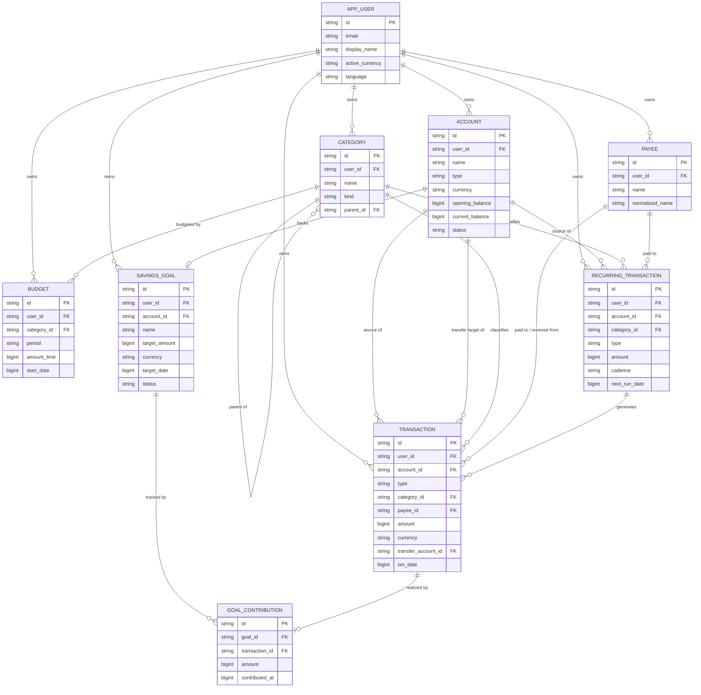
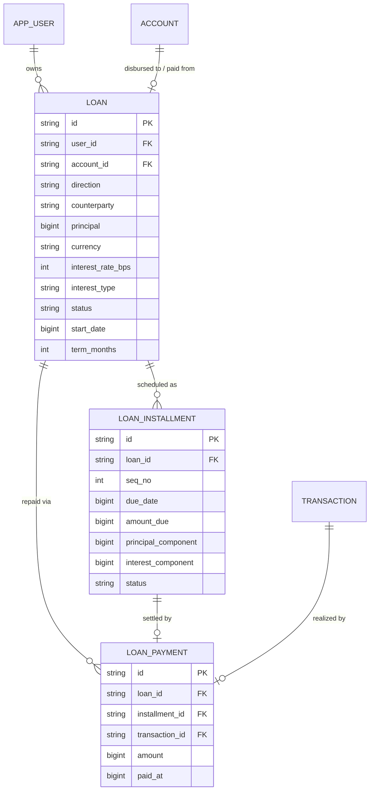
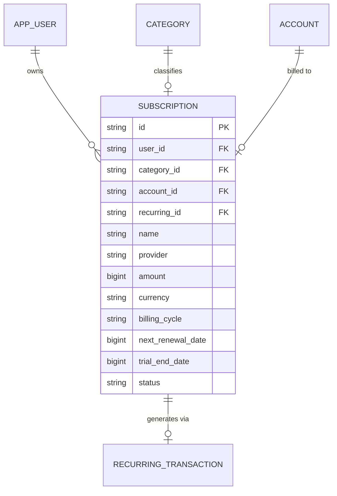
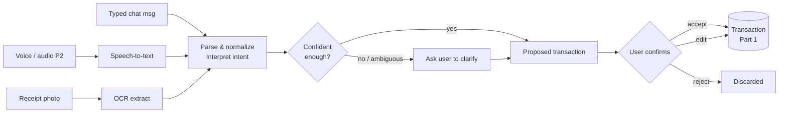
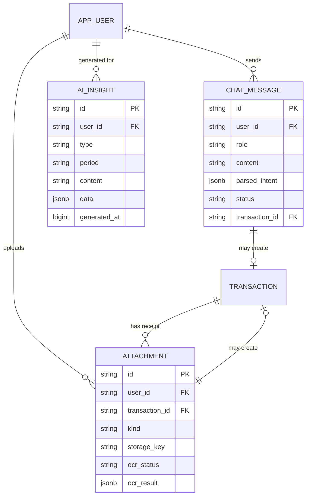
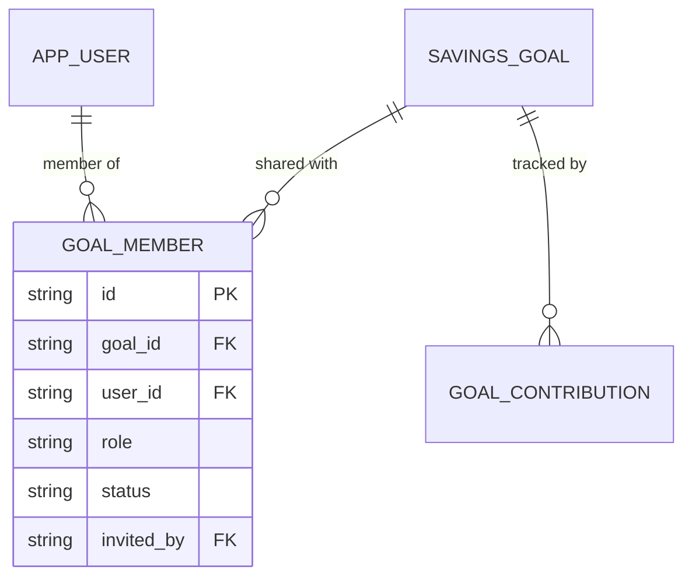
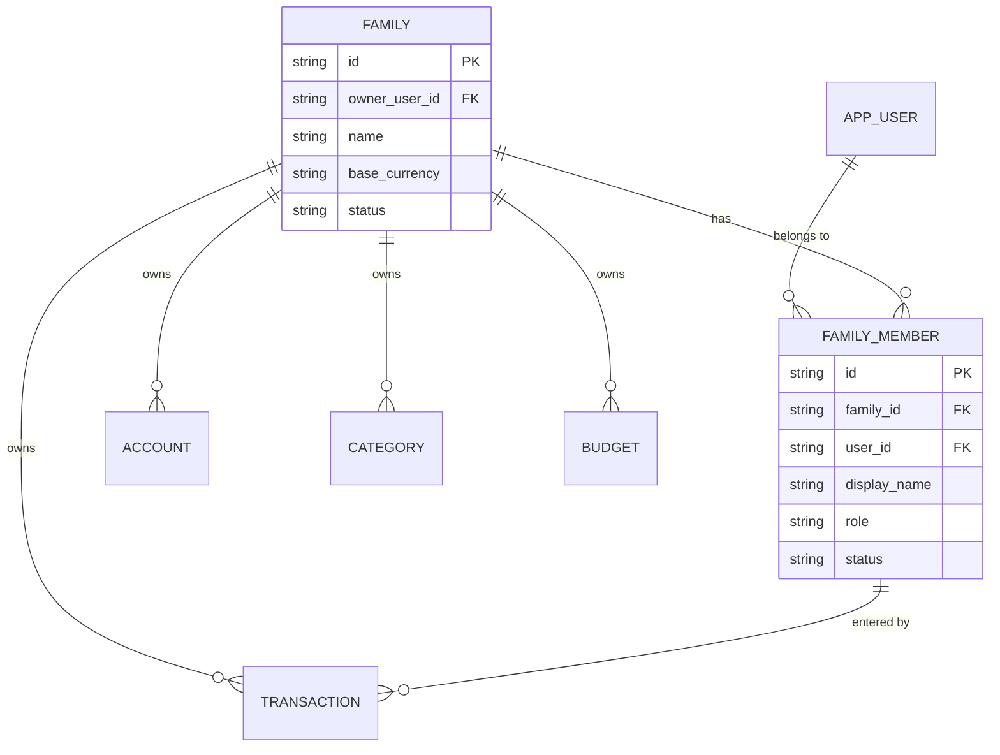
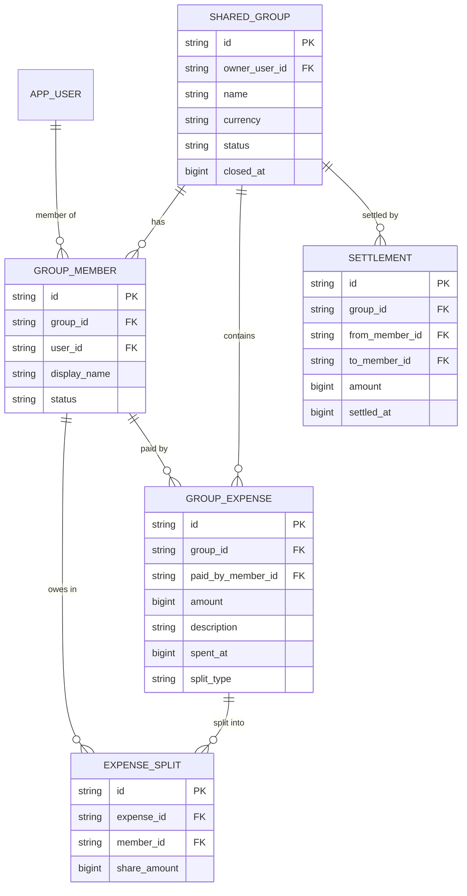

# Domain Documentation — ZenZ Money Manager

This is the **single source of truth** for the ZenZ Money Manager domain: the
entities, their fields, relationships, and the rules that govern them. It is the
basis for the database schema (`schema.md`) and the API design
(`../api/api-design.md`).

The finance domain replaces the legacy habit-tracker domain (`Habit`,
`HabitEntry`, `Reminder`). Auth and infrastructure (`app_user`, `user_roles`,
JWT, OAuth, Flyway, Redis) are kept unchanged — see
`../architecture/migration-plan.md`.

It complements the product-level [Features List](../features-list.md) and
[Roadmap](../roadmap.md); feature IDs (e.g. `F-1.16`) refer to those documents.

## Contents

- **Part 0 — [Foundations](#part-0--foundations)** — conventions, money, currency.
- **Part 1 — [Core Ledger](#part-1--core-ledger-mvp)** (MVP) — accounts, categories, transactions, budgets, recurring, savings goals, balances, net worth, access.
- **Part 2 — [Debts & Commitments](#part-2--debts--commitments-mvp)** (MVP) — loans/EMI, subscription tracking.
- **Part 3 — [Ingestion & AI](#part-3--ingestion--ai-mvp--p2)** (MVP + P2) — chat/NLP entry, auto-categorization, OCR receipts, AI insights, financial assistant.
- **Part 4 — [Security](#part-4--security-mvp)** (MVP) — app lock, encryption, login history, sessions.
- **Part 5 — [Sharing / Multi-user](#part-5--sharing--multi-user-phase-3)** (Phase 3) — family spaces, shared goals, Splitwise-style groups.
- **Part 6 — [Phasing & Traceability](#part-6--phasing--traceability)** — what ships when, schema/API mapping.

---

# Part 0 — Foundations

Every domain entity follows the conventions established by
`com.zenzmoney.common.domain.BaseEntity`.

## 0.1 Design conventions

| Convention | Rule |
|---|---|
| **Primary key** | `String id` — a UUID string (`VARCHAR(36)`), assigned in `BaseEntity.prePersist()` if unset. |
| **Ownership** | Every user-owned entity carries `user_id VARCHAR(36) NOT NULL`, indexed. Rows are always scoped to the authenticated user; no cross-user reads (until Part 5 sharing). |
| **Timestamps** | Epoch milliseconds stored as `BIGINT` (`created_time`, `modified_time`) via JPA auditing (`@CreatedDate` / `@LastModifiedDate`). Domain dates (e.g. `txn_date`) are also epoch-millis `BIGINT`. |
| **Audit** | `created_by` / `modified_by` (`VARCHAR(36)`) populated by JPA auditing. |
| **Concurrency** | Optimistic locking via `@Version` (`version BIGINT`). |
| **Enums** | Stored as `@Enumerated(EnumType.STRING)` in `VARCHAR(50)` columns. Enum types live in `common/domain`, mirroring the old `HabitStatus`. |
| **Free-form data** | Flexible attributes use a `jsonb` column mapped with `@JdbcTypeCode(SqlTypes.JSON)` (as `Habit.metadata` did). |

## 0.2 Money representation

**Amounts are stored as integer minor units in a `BIGINT` column, paired with an
ISO-4217 currency code.**

- `amount = 1050` with `currency = "USD"` means **$10.50**.
- Rationale: integer arithmetic avoids the rounding drift of floating-point
  money, and it is consistent with the codebase's existing "store time as
  epoch-millis `BIGINT`" style. No `DECIMAL`/`double` for money anywhere.
- The number of minor units per major unit is defined by the currency
  (2 for USD/EUR, 0 for JPY, 3 for BHD). Clients format for display; the backend
  only stores and sums minor units.
- Conversions between currencies are **not** performed implicitly. A transfer or
  report that spans currencies is either blocked (MVP) or carries an explicit
  `fx_rate` (Phase 2 — see [Roadmap](../roadmap.md)).
- Interest rates are stored as **basis points** in an `int` (e.g. `750` = 7.50%),
  same no-float-drift principle (see [§2.2](#22-loan)).

## 0.3 One active currency per user

**In the MVP, each user operates in a single active currency at a time.** The
currency is a **user-level** setting, not a per-account choice (feature F-1.23):

- The user picks their active currency (`app_user.active_currency`, ISO-4217) at
  onboarding.
- **Every** owned entity that stores money — `Account`, `Transaction`, `Budget`,
  `RecurringTransaction`, `SavingsGoal`, `Loan`, `Subscription` — carries
  `currency`, and all rows for a user share the user's active currency. Storing it
  per row keeps the money representation self-contained and makes a future switch
  to true multi-currency a non-breaking change.
- **Switching** the active currency is allowed but guarded: because amounts are
  stored as minor units in the old currency, a switch either (a) requires zero
  balances / accepting that historical figures stay in their original currency, or
  (b) applies an explicit one-time conversion. The exact switch policy is a product
  decision tracked in the [Roadmap](../roadmap.md); the domain simply guarantees a
  single active currency is in force at any moment.
- Genuinely **mixing** currencies within one user, and cross-currency FX, are
  **out of scope for the MVP**. The per-row `currency` column is the seam that
  makes that later work additive rather than a schema rewrite.

## 0.4 The `app_user` extensions

Beyond the existing auth columns, the domain adds these user-level fields:

| Field | Type | Notes | Introduced by |
|---|---|---|---|
| `activeCurrency` | `String(3)` | ISO-4217; the user's single active currency. | [§0.3](#03-one-active-currency-per-user) |
| `language` | `String(10)` | BCP-47 preferred language (e.g. `en`, `ta`, `si`). | F-1.24 |
| `appLockEnabled` | `boolean` | Default `false`. | [§4.2](#42-app-lock-client-side) |
| `appLockTimeoutSeconds` | `int` | Auto-lock delay. Default `60`. | [§4.2](#42-app-lock-client-side) |
| `biometricEnabled` | `boolean` | Whether biometric unlock is allowed. Default `false`. | [§4.2](#42-app-lock-client-side) |

---

# Part 1 — Core Ledger (MVP)

This is the core personal ledger — the tables every other part builds on.

## 1.1 Entity overview

| Entity | Aggregate root | Purpose |
|---|---|---|
| `Account` | ✔ | A place money lives — cash, bank, card, savings, wallet. |
| `Category` | ✔ | A hierarchical label for income/expense classification. |
| `Payee` | ✔ | A named merchant/person a transaction is paid to or received from. |
| `Transaction` | ✔ | The core ledger record — income, expense, or transfer. |
| `Budget` | ✔ | A spending cap for a category over a recurring period. |
| `RecurringTransaction` | ✔ | A template that generates future transactions on a cadence. |
| `SavingsGoal` | ✔ | A target amount backed by a real account, funded over time. |
| `GoalContribution` | | A funding event linking a goal to the real transaction that moved the money. |

## 1.2 Entity Relationship Diagram



## 1.3 Enumerations

Defined in `com.<pkg>.common.domain` (replacing `HabitStatus`), stored as
`VARCHAR(50)` via `EnumType.STRING`.

```java
public enum AccountType      { CASH, BANK, CARD, SAVINGS, WALLET }
public enum AccountStatus    { ACTIVE, ARCHIVED, DELETED }
public enum CategoryKind     { INCOME, EXPENSE }
public enum TransactionType  { INCOME, EXPENSE, TRANSFER }
public enum BudgetPeriod     { WEEKLY, MONTHLY, YEARLY }
public enum RecurringCadence { DAILY, WEEKLY, MONTHLY, YEARLY }
public enum GoalStatus       { ACTIVE, ACHIEVED, ARCHIVED }
```

## 1.4 Account

A place where money is held. Owned by one user.

| Field | Type | Notes |
|---|---|---|
| `id` | `String` (UUID) | PK, from `BaseEntity`. |
| `userId` | `String` | Owner. Not null, indexed. |
| `name` | `String(300)` | Display name, e.g. "Chase Checking". Not null. |
| `type` | `AccountType` | Not null. |
| `currency` | `String(3)` | ISO-4217. In the MVP this always equals the owner's `active_currency` ([§0.3](#03-one-active-currency-per-user)); stored per-account so a later multi-currency phase is additive. |
| `openingBalance` | `long` | Minor units at account creation. Default `0`. |
| `currentBalance` | `long` | Minor units. Maintained by the ledger (see [§1.10](#110-balance-derivation-invariant)). |
| `color` | `String(20)` | Optional UI hint. |
| `icon` | `String(50)` | Optional UI hint. |
| `status` | `AccountStatus` | Default `ACTIVE`. |
| `sortOrder` | `int` | Manual ordering. Default `0`. |
| `metadata` | `jsonb` | Free-form (e.g. masked account number). |

**Rules**
- An account's `currency` mirrors the owner's active currency ([§0.3](#03-one-active-currency-per-user)). New accounts are created in the user's active currency and are not individually re-denominated; changing currency is a user-level switch.
- **Credit cards** are an `AccountType.CARD` that may carry a **negative** `currentBalance`, counted as a liability in net worth ([§1.11](#111-net-worth-derived)). Statement cycles / minimum payments / limits are not modeled yet.
- Archiving (`status = ARCHIVED`) hides the account from pickers but preserves history. Archived accounts cannot receive new transactions.
- Deleting an account is a **soft delete**: `status = DELETED` and the row is **retained** in the database (for audit / recovery), then hidden from every listing and operation (a soft-deleted account reads as *not found*). Delete is only allowed when the account has **no transactions**; an account with history must be **archived** instead. Rows are never physically removed by the API — this keeps foreign keys from transactions/goals valid and preserves the audit trail. Derived figures (balances, net worth) exclude `DELETED` accounts.

## 1.5 Category

A hierarchical label used to classify transactions. Owned by one user.

| Field | Type | Notes |
|---|---|---|
| `id` | `String` (UUID) | PK. |
| `userId` | `String` | Owner. Not null, indexed. |
| `name` | `String(200)` | Not null. |
| `kind` | `CategoryKind` | `INCOME` or `EXPENSE`. Not null. |
| `parentId` | `String` | Nullable. Self-reference for sub-categories. |
| `color` | `String(20)` | Optional. |
| `icon` | `String(50)` | Optional. |
| `sortOrder` | `int` | Default `0`. |

**Rules**
- Hierarchy is **one level deep**: a category with a `parentId` may not itself be a parent. Enforced in the service layer.
- A parent and its children must share the same `kind`.
- A category referenced by any transaction or budget cannot be deleted; it can be merged into another category (Phase 2, F-2.4) or left unused.
- `TRANSFER` transactions carry **no** category.
- **Seed categories.** At onboarding each new user is provisioned a default set so the app is not empty (F-1.25). Suggested defaults:
  - **Income** (`kind = INCOME`): Salary, Business, Freelance, Investments, Gifts.
  - **Expense** (`kind = EXPENSE`): Food & Drinks, Groceries, Transport, Housing, Utilities, Entertainment, Health, Shopping, Education, Subscriptions, Other.
  These are ordinary user-owned `Category` rows (fully editable/deletable), not a system table — seeding just copies a template into the user's own categories.

## 1.5b Payee

A named **merchant or person** a transaction is paid to (expense) or received from
(income). Owned by one user. Modeled as an entity — rather than a free-text string
on the transaction — so that payee is a **first-class filter/report dimension**
(F-1.19): "total spent at Keells", payee autocomplete, and dedup of
"Keells" / "keells" / "Keells Super" into one row.

| Field | Type | Notes |
|---|---|---|
| `id` | `String` (UUID) | PK. |
| `userId` | `String` | Owner. Not null, indexed. |
| `name` | `String(300)` | Display name as first entered, e.g. "Keells". Not null. |
| `normalizedName` | `String(300)` | Lower-cased/trimmed/whitespace-collapsed key for matching and uniqueness. Not null. |
| `color` | `String(20)` | Optional UI hint. |
| `icon` | `String(50)` | Optional UI hint. |

**Rules**
- **Uniqueness:** at most one payee per (`userId`, `normalizedName`) — enforced by a
  unique index. Resolving "Keells" and "keells" collapses to the same row.
- **Resolve-or-create:** every transaction-writing path (manual entry, chat/NLP
  capture F-1.9a, OCR F-1.9c) resolves a typed payee name to a `Payee` via a
  service (`resolveOrCreate`): normalize → find by (`userId`, `normalizedName`) →
  else create. Payees are never entered as opaque strings on the transaction.
- **Optional on a transaction:** `TRANSFER` and unnamed one-off entries
  ("$5 for burger") have **no** payee (`payeeId` null). The item/description in such
  cases goes to the transaction's `note`, not to a payee.
- A payee referenced by any transaction cannot be hard-deleted; it can be **merged**
  into another payee (mirrors category merge, Phase 2 F-2.4) or left unused.
- Scoped by `user_id` like every owned entity (§1.12); no cross-user payees.

## 1.6 Transaction

The core ledger record. Every movement of money is one transaction row.

| Field | Type | Notes |
|---|---|---|
| `id` | `String` (UUID) | PK. |
| `userId` | `String` | Owner. Not null, indexed. |
| `accountId` | `String` | Source account. Not null, FK → `account`. |
| `type` | `TransactionType` | `INCOME` / `EXPENSE` / `TRANSFER`. Not null. |
| `categoryId` | `String` | FK → `category`. Required for INCOME/EXPENSE, null for TRANSFER. |
| `amount` | `long` | Minor units. **Always positive**; sign is derived from `type`. Not null. |
| `currency` | `String(3)` | ISO-4217. Equals the owner's active currency ([§0.3](#03-one-active-currency-per-user)); in the MVP every account shares it, so it always matches the account currency. |
| `transferAccountId` | `String` | FK → `account`. Set **only** when `type = TRANSFER`. |
| `txnDate` | `long` | Epoch millis of the transaction date. Not null, indexed. |
| `payeeId` | `String` | Optional FK → `payee` ([§1.5b](#15b-payee)). The merchant/payer as an entity, not free text. Null for TRANSFER and unnamed one-off entries. Indexed (drives payee filtering, F-1.19). |
| `note` | `String(500)` | Optional free-text description / item (e.g. "burger", "tea things"). |
| `tags` | `jsonb` | Optional string array. |
| `recurringId` | `String` | Nullable FK → `recurring_transaction` if auto-generated. |

**Rules**
- `amount` is stored as a positive magnitude. Effect on balance is determined by `type`: INCOME adds, EXPENSE subtracts, TRANSFER subtracts from `accountId` and adds to `transferAccountId`.
- `type = TRANSFER` **requires** `transferAccountId` (≠ `accountId`) and forbids `categoryId`. Both accounts share the user's active currency, so no conversion is involved in the MVP.
- `type ∈ {INCOME, EXPENSE}` **requires** `categoryId` whose `kind` matches the type, and forbids `transferAccountId`.
- Editing or deleting a transaction re-derives affected account balances ([§1.10](#110-balance-derivation-invariant)).
- **Duplicating** a transaction (F-1.5b) creates a new row copying all fields except `id`/timestamps, defaulting `txnDate` to now. The copy is an independent transaction.
- **Attachments** (receipts/images) link via the `Attachment` entity ([§3.5](#35-attachment-receipts--ocr)); a transaction may have zero or more, added manually or produced by OCR.
- **Search & filter** (F-1.19) over transactions (date range, category, account, amount, payee, tag, free text) is a first-class MVP capability; the indexed `txnDate`, `userId`, `accountId`, `categoryId`, and `payeeId` columns support it. Payee filtering is by `payeeId` ([§1.5b](#15b-payee)), not free-text match.

## 1.7 Budget

A spending cap for a category (or overall) across a recurring period.

| Field | Type | Notes |
|---|---|---|
| `id` | `String` (UUID) | PK. |
| `userId` | `String` | Owner. Not null, indexed. |
| `categoryId` | `String` | FK → `category`. Nullable ⇒ overall budget. |
| `period` | `BudgetPeriod` | `WEEKLY` / `MONTHLY` / `YEARLY`. Not null. |
| `amountLimit` | `long` | Minor units cap for the period. Not null. |
| `currency` | `String(3)` | ISO-4217. |
| `startDate` | `long` | Epoch millis; anchors the period cycle. Not null. |
| `rollover` | `boolean` | Carry unused amount into the next period. Default `false`. |
| `status` | `AccountStatus` | Reused enum: `ACTIVE` / `ARCHIVED`. |

**Rules**
- A budget's `categoryId` (if set) must be an `EXPENSE` category.
- At most one active budget per (`categoryId`, `period`) per user.
- "Spent" is computed from EXPENSE transactions in the current period window; budgets store the cap, not the running total.
- Budget usage feeds alerts (F-1.20), e.g. *"You've used 90% of your Food budget."*

## 1.8 RecurringTransaction

A template that generates `Transaction` rows on a schedule. Works for both income
(e.g. *salary $3000 on the 25th monthly*) and expense (e.g. rent).

| Field | Type | Notes |
|---|---|---|
| `id` | `String` (UUID) | PK. |
| `userId` | `String` | Owner. Not null, indexed. |
| `accountId` | `String` | FK → `account`. Not null. |
| `categoryId` | `String` | FK → `category`. Required unless `type = TRANSFER`. |
| `type` | `TransactionType` | Not null. |
| `amount` | `long` | Minor units, positive. Not null. |
| `currency` | `String(3)` | ISO-4217. |
| `transferAccountId` | `String` | Set only for TRANSFER templates. |
| `cadence` | `RecurringCadence` | Not null. |
| `nextRunDate` | `long` | Epoch millis of the next generation. Not null, indexed. |
| `endDate` | `long` | Nullable; stop generating after this. |
| `active` | `boolean` | Default `true`. |
| `payeeId` | `String` | Optional FK → `payee` ([§1.5b](#15b-payee)). Copied onto generated transactions. |
| `note` | `String(500)` | Copied onto generated transactions. |

**Rules**
- A scheduled job scans `active = true AND next_run_date <= now`, creates a `Transaction` (with `recurringId` set back to the template), then advances `nextRunDate` by the cadence.
- The same validation as `Transaction` applies to the generated row.
- Reaching `endDate` sets `active = false`.

## 1.9 SavingsGoal & GoalContribution

A **SavingsGoal** is a target the user is saving toward, **backed by a real
account**. Progress is measured by real money movements, so the goal can never
diverge from the ledger. Personal and single-owner in the MVP; its shared form
(`GoalMember`) is Phase 3 — see [§5.2](#52-shared-savings-goals-goalmember).

### SavingsGoal

| Field | Type | Notes |
|---|---|---|
| `id` | `String` (UUID) | PK. |
| `userId` | `String` | Owner. Not null, indexed. |
| `accountId` | `String` | FK → `account` that backs the goal (typically a `SAVINGS` account). Not null. |
| `name` | `String(300)` | e.g. "Japan Trip". Not null. |
| `targetAmount` | `long` | Minor units. Not null. |
| `currency` | `String(3)` | ISO-4217. Equals the owner's active currency and the backing account's currency. |
| `targetDate` | `long` | Epoch millis; nullable soft deadline. |
| `status` | `GoalStatus` | `ACTIVE` / `ACHIEVED` / `ARCHIVED`. Default `ACTIVE`. |
| `color` / `icon` | `String` | Optional UI hints. |

**Progress is derived, not stored:**

```
saved     = Σ GOAL_CONTRIBUTION.amount for this goal
progress  = saved / target_amount
remaining = max(0, target_amount - saved)
```

`status` flips to `ACHIEVED` when `saved >= target_amount` (service layer, on each contribution). A goal never holds a phantom balance.

### GoalContribution

A single funding event linking a `SavingsGoal` to the **real** `Transaction` that
moved money into the backing account.

| Field | Type | Notes |
|---|---|---|
| `id` | `String` (UUID) | PK. |
| `goalId` | `String` | FK → `savings_goal`. Not null, indexed. |
| `transactionId` | `String` | FK → `transaction` (the TRANSFER into the backing account). Nullable for a manual/adjustment entry. |
| `amount` | `long` | Minor units, positive. Not null. |
| `contributedAt` | `long` | Epoch millis. Not null. |
| `note` | `String(500)` | Optional. |

**Rules**
- A contribution's `amount`/`currency` must match its linked transaction.
- Deleting the linked transaction deletes (or voids) the contribution.
- Contributions are additive; a "withdrawal" is recorded as a transfer out of the backing account plus a reversing contribution, so `saved` always reflects the earmarked total.
- In the MVP the contributing user is always the goal owner; the Phase 3 shared form adds a `userId` per contribution to attribute members ([§5.2](#52-shared-savings-goals-goalmember)).

## 1.10 Balance derivation (invariant)

`Account.currentBalance` is a **materialized** value kept consistent with the
ledger, not a free-standing field clients can set:

```
currentBalance = openingBalance
               + Σ(amount) where type = INCOME  and account_id   = this
               - Σ(amount) where type = EXPENSE and account_id   = this
               - Σ(amount) where type = TRANSFER and account_id  = this   (outgoing)
               + Σ(amount) where type = TRANSFER and transfer_account_id = this  (incoming)
```

- The service layer updates `currentBalance` inside the same transaction that creates/edits/deletes a `Transaction`.
- A recompute endpoint/job can rebuild it from the ledger if drift is ever detected (defensive; the ledger is the source of truth).

> **Two kinds of "drift" — don't confuse them.** The recompute above fixes
> *internal* drift (stored `currentBalance` vs. the sum of the ledger). It does
> **not** address the app's balance diverging from the user's **real bank
> balance** — that is reconciliation ([§1.10b](#110b-reconciliation)).

## 1.10b Reconciliation

Over time a user's tracked balance can diverge from their **real-world** account
balance — usually because some transactions were never entered (a forgotten cash
expense, a bank fee). Reconciliation brings the two back into agreement (F-1.2b).

**The balance is never edited directly.** `currentBalance` is derived
([§1.10](#110-balance-derivation-invariant)); typing a new value would (a) be
overwritten by the next recompute and (b) desync the balance from the ledger, so
spending/income reports would no longer add up. Instead, reconciliation records a
**balance adjustment**: an ordinary `Transaction` for the difference.

```
difference = actual_real_balance − app_current_balance
  difference < 0  → app shows MORE than reality (missed expenses)  → EXPENSE adjustment
  difference > 0  → app shows LESS than reality (missed income)    → INCOME  adjustment
  difference = 0  → already reconciled; nothing to record
```

The adjustment is a normal INCOME/EXPENSE row assigned to a reserved
**"Adjustment"** (or "Uncategorized") category — **no new entity and no new
`TransactionType`**. Because it flows through the ledger like any other
transaction, the balance corrects itself via [§1.10](#110-balance-derivation-invariant),
net worth stays right, total spending/income stays honest (the money really did
move), and the correction is fully auditable — the user can later re-categorize or
split it if they remember what it was.

**Example.** Opening $5000; app shows $1200; the bank actually shows $600. The
user reconciles to $600 → the app records an **EXPENSE of $600** (`1200 − 600`) to
the Adjustment category, and `currentBalance` derives to $600. Reversed (app $600,
bank $1200) it records an **INCOME of $600**.

**UX (not domain):** a "reconcile" action takes the user's stated real balance,
computes the difference, and creates the adjustment for them — they never do the
subtraction by hand.

## 1.11 Net worth (derived)

**Net worth is a derived figure, never stored.** It powers the dashboard
(F-1.13) and is computed on read:

```
assets      = Σ Account.currentBalance where currentBalance >= 0   (cash, bank, savings)
            + Σ Loan.outstanding       where direction = LENT       (receivables)
liabilities = Σ |Account.currentBalance| where currentBalance < 0   (e.g. credit-card debt)
            + Σ Loan.outstanding       where direction = BORROWED
net_worth   = assets - liabilities
```

- Loan figures come from [§2.2](#22-loan).
- All terms are in the user's single active currency ([§0.3](#03-one-active-currency-per-user)), so the subtraction is currency-safe in the MVP.
- Because every term is itself derived from the ledger, net worth is always reproducible and auditable.

## 1.12 Ownership & access (MVP)

Every query is scoped by `user_id` from the JWT principal, exactly as the habit
domain scoped by `user_id`. There is no sharing between users in the MVP.
`ROLE_ADMIN` may read aggregate/system data but does not bypass per-user
transaction scoping. See the existing role guide for how `@RolesAllowed` and the
JWT filter enforce this. (Part 5 sharing replaces this with membership-based
access for shared entities only.)

---

# Part 2 — Debts & Commitments (MVP)

Two MVP features that model **money the user is committed to over time**, layered
on the core ledger. **Design principle — reuse the ledger, don't shadow it:** a
debt/subscription is a *plan*; the actual money movements are ordinary
`Transaction`s linked back to the plan, so balances and reports stay correct
without a parallel ledger.

## 2.1 Debts & Loans — concept

A **Loan** (F-1.16) is a debt agreement with a principal, an interest rate, and a
repayment schedule of **installments** (EMIs). It covers both directions:

- **Borrowing** (`BORROWED`) — the user owes someone (home/car loan, money from a friend). A liability; reduces net worth.
- **Lending** (`LENT`) — someone owes the user. A receivable (asset).

Each scheduled installment is a `LoanInstallment`; each real repayment is a
`Transaction` linked via `LoanPayment`, so outstanding balance is reconciled with
the ledger.



```java
public enum LoanDirection     { BORROWED, LENT }
public enum InterestType      { NONE, FLAT, REDUCING }
public enum LoanStatus        { ACTIVE, CLOSED, DEFAULTED, ARCHIVED }
public enum InstallmentStatus { DUE, PAID, PARTIAL, OVERDUE }
```

## 2.2 Loan

| Field | Type | Notes |
|---|---|---|
| `id` | `String` (UUID) | PK. |
| `userId` | `String` | Owner. Not null, indexed. |
| `accountId` | `String` | FK → `account` money is disbursed to (BORROWED) or paid from (LENT). Nullable if untracked. |
| `direction` | `LoanDirection` | `BORROWED` / `LENT`. Not null. |
| `name` | `String(300)` | e.g. "Car Loan". Not null. |
| `counterparty` | `String(300)` | Lender/borrower name (bank, friend). Optional. |
| `principal` | `long` | Original amount in minor units. Not null. |
| `currency` | `String(3)` | ISO-4217; the user's active currency. |
| `interestRateBps` | `int` | Annual interest rate in **basis points** (e.g. 750 = 7.50%). `0` for interest-free. |
| `interestType` | `InterestType` | `FLAT` / `REDUCING` / `NONE`. Not null. |
| `startDate` | `long` | Epoch millis when the loan starts. Not null. |
| `termMonths` | `int` | Number of installments. Nullable for open-ended. |
| `status` | `LoanStatus` | `ACTIVE` / `CLOSED` / `DEFAULTED` / `ARCHIVED`. Default `ACTIVE`. |
| `note` | `String(500)` | Optional. |

**Derived values (not stored):**

```
outstanding = Σ LOAN_INSTALLMENT.principal_component (unpaid)
paid_total  = Σ LOAN_PAYMENT.amount
next_due    = earliest LOAN_INSTALLMENT with status = DUE
```

**Rules**
- `status` flips to `CLOSED` when every installment is `PAID`.
- A `BORROWED` loan contributes to **liabilities** in net worth ([§1.11](#111-net-worth-derived)); a `LENT` loan is a receivable (asset).
- Interest is computed by the service layer from `interestType` + `interestRateBps` when the schedule is generated; the domain stores the resulting per-installment components, not a running formula.

## 2.3 LoanInstallment (EMI schedule)

One row per scheduled payment. Generated when the loan is created (regenerated if
terms change), splitting each EMI into principal + interest.

| Field | Type | Notes |
|---|---|---|
| `id` | `String` (UUID) | PK. |
| `loanId` | `String` | FK → `loan`. Not null, indexed. |
| `seqNo` | `int` | 1-based installment number. |
| `dueDate` | `long` | Epoch millis. Not null, indexed. |
| `amountDue` | `long` | Total EMI for this period (principal + interest). |
| `principalComponent` | `long` | Portion reducing principal. |
| `interestComponent` | `long` | Portion that is interest. |
| `status` | `InstallmentStatus` | `DUE` / `PAID` / `PARTIAL` / `OVERDUE`. Default `DUE`. |

**Rules**
- `amountDue = principalComponent + interestComponent` for every row.
- `Σ principalComponent` across all installments = `Loan.principal` (rounding remainders distributed deterministically).
- Marked `OVERDUE` by a scheduled job when `due_date < now` and not `PAID`; feeds reminders (F-1.20).

## 2.4 LoanPayment

Links a real repayment `Transaction` to the loan (and optionally the installment
it settles).

| Field | Type | Notes |
|---|---|---|
| `id` | `String` (UUID) | PK. |
| `loanId` | `String` | FK → `loan`. Not null, indexed. |
| `installmentId` | `String` | FK → `loan_installment`. Nullable (a lump-sum prepayment may span several). |
| `transactionId` | `String` | FK → `transaction` (EXPENSE for BORROWED, INCOME for LENT). Not null. |
| `amount` | `long` | Minor units. Must match the linked transaction. |
| `paidAt` | `long` | Epoch millis. |

**Rules**
- Recording a payment updates the target installment(s) to `PAID`/`PARTIAL`.
- Deleting the linked transaction voids the payment and reopens the installment.
- A **payoff plan** is a derived projection (service layer): given `outstanding`, rate, and a chosen extra-payment amount, project the revised payoff date and interest saved. No stored entity. (Multi-debt strategies like snowball/avalanche are a proposal, F-P.12.)

## 2.5 Subscription tracking

A **Subscription** (F-1.17) is the user's own recurring paid service (Netflix,
Spotify, gym) — essentially a **named, categorized recurring expense with a
renewal date and reminders**. Rather than a separate ledger, it is a thin
specialization that *drives* a `RecurringTransaction` ([§1.8](#18-recurringtransaction))
and adds subscription-specific metadata.

> **Not app billing.** This tracks subscriptions the user pays to *third parties*.
> The user's own ZenZ Free/Premium plan (F-2.2) is separate app-monetization, not
> part of this feature.



| Field | Type | Notes |
|---|---|---|
| `id` | `String` (UUID) | PK. |
| `userId` | `String` | Owner. Not null, indexed. |
| `name` | `String(300)` | e.g. "Netflix Premium". Not null. |
| `provider` | `String(200)` | Vendor. Optional. |
| `categoryId` | `String` | FK → `category` (an EXPENSE category, e.g. "Entertainment"). |
| `accountId` | `String` | FK → `account` it is billed to (card/bank). |
| `recurringId` | `String` | FK → `recurring_transaction` that auto-generates the charge. Nullable if the user only tracks it (no auto-posting). |
| `amount` | `long` | Minor units per cycle. Not null. |
| `currency` | `String(3)` | ISO-4217; user's active currency. |
| `billingCycle` | `RecurringCadence` | Reuses the ledger enum: `MONTHLY` / `YEARLY` / etc. |
| `nextRenewalDate` | `long` | Epoch millis. Indexed (drives reminders). |
| `trialEndDate` | `long` | Epoch millis; nullable free-trial end. |
| `status` | `SubscriptionStatus` | `ACTIVE` / `TRIAL` / `PAUSED` / `CANCELLED`. Default `ACTIVE`. |
| `note` | `String(500)` | Optional. |

```java
public enum SubscriptionStatus { ACTIVE, TRIAL, PAUSED, CANCELLED }
```

**Rules**
- When linked to a `RecurringTransaction`, the subscription does **not** post its own transactions — the recurring engine does, and the generated `Transaction` carries the subscription's category/account. Avoids double-counting.
- Reminders (renewal soon, trial ending) are emitted via the notification system (F-1.20) keyed off `nextRenewalDate` / `trialEndDate`.
- `CANCELLED` stops future reminders and deactivates the linked recurring template; history is preserved.
- Total monthly subscription cost is a derived aggregate for the dashboard ("You spend $84/month on 6 subscriptions").

---

# Part 3 — Ingestion & AI (MVP + P2)

The **intelligent input and insight** side of the domain: how transactions get
created from natural language, voice, and scanned receipts, and how AI insights
are produced. Everything here ultimately produces or reads the `Transaction` rows
of [Part 1](#part-1--core-ledger-mvp).

The design principle is a single funnel: **every capture channel — typed chat,
voice, or a scanned receipt — is normalized into a proposed transaction, which the
user confirms before it enters the ledger.**

> **Phase.** Chat entry (F-1.9a), auto-categorization (F-1.9b), OCR (F-1.9c), AI
> insights (F-1.10), and the financial assistant (F-1.10b) are **MVP**. Voice
> entry (F-2.1) is **Phase 2**, reusing the pipeline with a speech-to-text front
> end.

## 3.1 The capture pipeline



| Channel | Raw input | Extraction step | Feature |
|---|---|---|---|
| Chat | Text message | NLP intent + entity parse | F-1.9a (MVP) |
| Voice | Audio clip | Speech-to-text → same NLP parse | F-2.1 (Phase 2) |
| Receipt | Image / PDF | OCR → field extraction → NLP normalize | F-1.9c (MVP) |

The output of all three is a **ParsedIntent** ([§3.3](#33-parsedintent-value-object)), rendered as a draft transaction for confirmation.

## 3.2 Entity overview

| Entity | Aggregate root | Purpose |
|---|---|---|
| `ChatMessage` | ✔ | A logged user/assistant message in the conversational interface. |
| `Attachment` | ✔ | An uploaded file (receipt image, PDF) plus its OCR extraction result. |
| `AiInsight` | ✔ | A generated insight/report snippet derived from the user's ledger. |

`ParsedIntent` is a **transient value object** — the structured result of
interpreting one input — stored inline (as `jsonb`) on the `ChatMessage`/`Attachment`.



## 3.3 ParsedIntent (value object)

The normalized interpretation of a single input. Not a table of its own; stored
inline (`jsonb`) on the message/attachment that produced it.

| Field | Type | Notes |
|---|---|---|
| `intent` | `IntentType` | What the user is trying to do. |
| `txnType` | `TransactionType` | Inferred `INCOME` / `EXPENSE` / `TRANSFER`. |
| `amount` | `long` | Minor units, in the user's active currency. |
| `categoryId` | `String` | Best-match category; null if unresolved. |
| `categoryGuess` | `String` | Raw label the model proposed (e.g. "food") before matching. |
| `accountId` | `String` | Target account; defaults to the user's default account. |
| `txnDate` | `long` | Resolved date ("yesterday" → epoch millis). Defaults to now. |
| `payeeName` | `String` | Optional merchant/payer **name** as extracted. Stays a name at the draft stage; resolved to a `payee` row ([§1.5b](#15b-payee)) via resolve-or-create only when the draft is confirmed. |
| `note` | `String` | Optional free-text description / item (e.g. "burger", "tea things"). |
| `confidence` | `double` | 0–1 model confidence; drives the confirm-vs-clarify branch. |
| `missingFields` | `string[]` | Fields the parser could not fill (prompts clarification). |
| `rawInput` | `String` | The original text/transcript for auditing. |

**Resolution rules**
- **Currency is never parsed from the message.** The amount is always interpreted in the user's single active currency ([§0.3](#03-one-active-currency-per-user)); a "$" or "€" in text is a magnitude marker, not a currency switch.
- **Auto-category detection (F-1.9b):** category matching resolves `categoryGuess` against the user's categories (case-insensitive, synonym/alias aware, language-aware). The parser infers a category (and sub-category) from merchant/keywords — *"Spent $15 at Starbucks"* → **Food & Drinks → Coffee** — and the user can **correct** the suggestion, which is fed back as a preference for future matching. If no match and confidence is high, the UI may offer to **create** the category.
- Relative dates ("today", "yesterday", "last Friday") resolve against the user's timezone.
- If `confidence < threshold` or `missingFields` is non-empty, the assistant asks a clarifying question instead of proposing a transaction.

```java
public enum IntentType {
    CREATE_TRANSACTION,   // "I spent $20 on food"
    UPDATE_TRANSACTION,   // "change that to $25"
    QUERY,                // "how much did I spend on food this month?"
    UNKNOWN               // fallback → ask to clarify
}
```

## 3.4 ChatMessage

The log of the conversational interface. Both user and assistant messages are
stored, so a conversation replays and a created transaction traces back to its
message.

| Field | Type | Notes |
|---|---|---|
| `id` | `String` (UUID) | PK. |
| `userId` | `String` | Owner. Not null, indexed. |
| `role` | `ChatRole` | `USER` or `ASSISTANT`. Not null. |
| `content` | `String` (text) | The message text (or transcript for voice). |
| `language` | `String(10)` | BCP-47 tag detected/selected (e.g. `en`, `ta`, `si`). |
| `parsedIntent` | `jsonb` | The `ParsedIntent` for interpreted user messages. Nullable. |
| `status` | `ChatMessageStatus` | Lifecycle of the interpretation. |
| `transactionId` | `String` | FK → `transaction` once a message creates/updates one. Nullable. |
| `sessionId` | `String` | Groups messages into a conversation thread. |

```java
public enum ChatRole          { USER, ASSISTANT }
public enum ChatMessageStatus { RECEIVED, PARSED, NEEDS_CLARIFICATION, CONFIRMED, REJECTED, FAILED }
```

**Rules**
- A `USER` message with `intent = CREATE_TRANSACTION` and sufficient confidence produces a **draft**; the transaction is only written after the user confirms, at which point `status = CONFIRMED` and `transactionId` is set.
- `UPDATE_TRANSACTION` requires a resolvable target (the last transaction in the session, or one the user names); otherwise `NEEDS_CLARIFICATION`.
- `QUERY` intents do not create transactions; they read the ledger and reply. This is the **financial assistant** (F-1.10b) — *"How much did I spend on food last month?"* → *"You spent $320 on food, 15% more than June."* Answers come from deterministic ledger aggregates ([§3.6](#36-aiinsight-insights--reports)) rendered into natural language in the user's language; it never fabricates figures. Query capability deepens in Phase 2 (F-2.3).

## 3.5 Attachment (receipts & OCR)

An uploaded file plus its OCR result. Doubles as the manual "attach a receipt"
feature (F-1.9).

| Field | Type | Notes |
|---|---|---|
| `id` | `String` (UUID) | PK. |
| `userId` | `String` | Owner. Not null, indexed. |
| `transactionId` | `String` | FK → `transaction`. Nullable until a transaction is created/linked. |
| `kind` | `AttachmentKind` | `RECEIPT` / `BILL` / `DOCUMENT`. |
| `storageKey` | `String(500)` | Object-storage key/path for the binary. The file itself is **not** stored in the DB. |
| `contentType` | `String(100)` | MIME type. |
| `fileSize` | `long` | Bytes. |
| `ocrStatus` | `OcrStatus` | `PENDING` / `PROCESSING` / `DONE` / `FAILED`. |
| `ocrResult` | `jsonb` | Extracted fields: merchant, date, total, tax, line items, currency-as-seen. Nullable. |

```java
public enum AttachmentKind { RECEIPT, BILL, DOCUMENT }
public enum OcrStatus      { PENDING, PROCESSING, DONE, FAILED }
```

**OCR result (`ocrResult` shape)** — provider-agnostic so the vendor can be swapped:

```
{ merchant, purchaseDate, currencyAsSeen, subtotal, tax, total,
  lineItems: [{ description, qty, unitPrice, amount }], rawText }
```

**Rules**
- OCR runs **asynchronously**: upload returns immediately with `ocrStatus = PENDING`; a worker fills `ocrResult`.
- The extracted `total` is normalized into the user's active currency and fed through the same draft-transaction confirmation flow ([§3.1](#31-the-capture-pipeline)). `currencyAsSeen` is reference only.
- Line items may map to multiple categories; the MVP creates **one** expense for the total and keeps line items as reference (splitting is a proposal, F-P.9).
- Deleting a transaction unlinks its attachments (`transactionId → null`); the binary is garbage-collected by a retention job.

## 3.6 AiInsight (insights & reports)

A generated, human-readable insight derived from the user's ledger — backing the
AI insights feature (F-1.10) and the narrative parts of reports and the dashboard.

| Field | Type | Notes |
|---|---|---|
| `id` | `String` (UUID) | PK. |
| `userId` | `String` | Owner. Not null, indexed. |
| `type` | `InsightType` | What kind of insight. |
| `period` | `String(20)` | Window it summarizes (e.g. `2026-07`, `2026-W29`). |
| `title` | `String(300)` | Short headline. |
| `content` | `String` (text) | Natural-language insight, in the user's language. |
| `severity` | `InsightSeverity` | `INFO` / `WARNING` / `CRITICAL` — drives UI emphasis. |
| `data` | `jsonb` | Structured backing figures (so the UI can render a chart alongside the text). |
| `generatedAt` | `long` | Epoch millis. Indexed. |
| `dismissed` | `boolean` | User dismissed it. Default `false`. |

```java
public enum InsightType {
    SPENDING_TREND,      // "You spent 30% more on dining this month."
    BUDGET_RISK,         // "You'll exceed your Groceries budget in ~5 days."
    ANOMALY,             // "Unusual $400 charge — larger than your typical."
    SAVING_SUGGESTION,   // "Move $50/week to hit your Japan Trip goal by Dec."
    GOAL_PROGRESS,       // "You're 60% to your Emergency Fund."
    SUMMARY              // periodic recap
}
public enum InsightSeverity { INFO, WARNING, CRITICAL }
```

**Rules**
- Insights are **derived and read-only**; they never modify the ledger. Figures must be reproducible from `Transaction`/`Budget`/`SavingsGoal`/`Loan` data.
- Generated on a schedule and/or on demand; regeneration supersedes prior insights for the same `(type, period)`.
- The AI is a **presentation/analysis layer over deterministic aggregates** — numbers in `data` come from ledger queries; the model turns them into language. Keeps insights accurate and auditable.
- All insight text respects the user's selected language (F-1.24).

## 3.7 Privacy, safety & language

- **User confirmation gate.** No AI/OCR/NLP channel writes to the ledger without explicit user confirmation of the draft. The model *proposes*; the user *commits*.
- **Scoping.** Every entity here is scoped by `user_id` ([§1.12](#112-ownership--access-mvp)). No cross-user data reaches the model.
- **Language.** Detected/selected language is stored on `ChatMessage` and honored when generating `AiInsight.content`.
- **Provider independence.** `ocrResult` and `AiInsight.data` are normalized shapes so the underlying NLP/OCR/LLM provider can be replaced without touching the domain.

---

# Part 4 — Security (MVP)

**Application security** beyond the core authentication that already exists —
protecting access to financial data. These concern the *user's account and
device*, not money movements. The existing auth stack (JWT, OAuth, email/OTP,
`app_user`, `user_roles`, Redis) is unchanged.

> **Phase.** App lock, encryption, login history, and session management are
> **MVP** (F-1.18).

## 4.1 Feature overview

| Feature | What it protects | Where enforced |
|---|---|---|
| **App lock** (PIN / biometric) | Local device access to a logged-in session. | Client-side gate; server unaffected. |
| **Data encryption** | Data at rest and in transit. | Infrastructure + DB, not per-entity domain. |
| **Login history** | Visibility into account access. | Server: `login_event` records. |
| **Session management** | Control over active sessions/devices. | Server: `user_session` records + token revocation. |

## 4.2 App lock (client-side)

A second gate *after* login: even with a valid session, opening the app requires a
**PIN** or **biometric** (fingerprint/face) unlock on the device.

- **Not a server entity.** The unlock secret never leaves the device. The server only stores preferences on `app_user` ([§0.4](#04-the-app_user-extensions)); the PIN hash / biometric enrollment lives in the platform secure store (Keychain / Keystore).
- Configurable **auto-lock timeout** (e.g. lock after 1 min in background).
- Failed-attempt handling (backoff, optional wipe of local cache) is a client policy.

## 4.3 Data encryption

- **In transit:** all API traffic over TLS (HTTPS) — infrastructure baseline.
- **At rest:** database-level encryption; object storage (receipt attachments, [§3.5](#35-attachment-receipts--ocr)) encrypted by the storage provider.
- **Secrets:** JWT signing keys and provider credentials via the platform secret manager, never in the DB.

Infrastructure/deployment concern — no entities introduced; documented here so the security surface is complete in one place.

## 4.4 Login history — LoginEvent

An append-only audit of authentication events.

| Field | Type | Notes |
|---|---|---|
| `id` | `String` (UUID) | PK. |
| `userId` | `String` | Owner. Not null, indexed. |
| `eventType` | `LoginEventType` | See enum. |
| `ipAddress` | `String(45)` | IPv4/IPv6. Optional (privacy-configurable). |
| `userAgent` | `String(500)` | Device/browser string. |
| `deviceLabel` | `String(200)` | Friendly device name if resolvable. |
| `location` | `String(200)` | Coarse geo (city/country) from IP. Optional. |
| `occurredAt` | `long` | Epoch millis. Indexed. |

```java
public enum LoginEventType { LOGIN_SUCCESS, LOGIN_FAILURE, LOGOUT, TOKEN_REFRESH, PASSWORD_CHANGE }
```

**Rules**
- Append-only; never updated or deleted by users. Retention is policy-bound (e.g. 90 days) via a cleanup job.
- `LOGIN_FAILURE` events feed rate-limiting / suspicious-activity alerts.

## 4.5 Session management — UserSession

A record of each active authenticated session/device, so a user can **see active
sessions and remotely sign out** a device.

| Field | Type | Notes |
|---|---|---|
| `id` | `String` (UUID) | PK. |
| `userId` | `String` | Owner. Not null, indexed. |
| `deviceLabel` | `String(200)` | Friendly device name. |
| `userAgent` | `String(500)` | Client string. |
| `ipAddress` | `String(45)` | Last-seen IP. |
| `createdAt` | `long` | Epoch millis when the session began. |
| `lastSeenAt` | `long` | Epoch millis, updated on activity. |
| `expiresAt` | `long` | Epoch millis; session/refresh-token expiry. |
| `status` | `SessionStatus` | `ACTIVE` / `REVOKED` / `EXPIRED`. |

```java
public enum SessionStatus { ACTIVE, REVOKED, EXPIRED }
```

**Rules**
- Backed by the existing refresh-token / Redis infrastructure; this entity is the user-visible view plus the ability to **revoke**.
- Revoking a session sets `status = REVOKED` and invalidates its refresh token so the next refresh fails, forcing re-login on that device.
- "Sign out everywhere" revokes all of a user's sessions except (optionally) the current one.

---

# Part 5 — Sharing / Multi-user (Phase 3)

> **Status: Phase 3.** These features deliberately break the MVP's "every row is
> scoped to one `user_id`, no sharing" rule ([§1.12](#112-ownership--access-mvp)),
> so they are gated behind their own phase. Build the MVP first; add these on top
> **without changing the core `Transaction` model**.

This part covers three multi-user features:

1. **Shared Savings Goals** — the personal `SavingsGoal` ([§1.9](#19-savingsgoal--goalcontribution)) is MVP; this adds the layer that makes a goal **shareable** (`GoalMember`).
2. **Family Spaces** — a permanent **shared workspace** for a household: shared accounts, categories, budgets, and transactions every member sees, with per-member attribution.
3. **Shared Groups** — a Splitwise-style temporary group with its own expense ledger, member split balances, settle-up, and a **close** action.

### Family vs. Shared Group — why they differ

A **Family** is a **permanent, pooled** household — money is genuinely shared and
there is no "who owes whom." A **Shared Group** is a **temporary, settle-up**
ledger — money is *not* pooled; it tracks debts between members and then closes.
They share multi-user plumbing (invites, member roles, access-by-membership) but
model money completely differently, so they are separate entities.

### The `Space` concept

Family sharing generalizes ownership from a single `user_id` to a **Space** — an
ownership boundary that owns accounts, categories, budgets, and transactions.

- A **personal space** is implicit for every user (their MVP data — no migration; a null/`personal` space id means "the owner's personal space").
- A **family space** is an explicit, shared `Space` with members.

This is the single structural change that lets the same `Account`/`Transaction`
tables be either personal or shared, without a second set of tables.

## 5.1 New enumerations

```java
// Family spaces
public enum FamilyStatus { ACTIVE, ARCHIVED }
public enum FamilyRole   { ADMIN, MEMBER, VIEWER }

// Shared groups
public enum GroupStatus { OPEN, SETTLING, CLOSED }
public enum SplitType   { EQUAL, EXACT, PERCENT, SHARES }

// Membership (shared goals + shared groups)
public enum MemberRole   { OWNER, CONTRIBUTOR, VIEWER, MEMBER }
public enum MemberStatus { INVITED, ACTIVE, LEFT }
```

## 5.2 Shared Savings Goals (GoalMember)

The base `SavingsGoal` / `GoalContribution` are MVP ([§1.9](#19-savingsgoal--goalcontribution)).
Phase 3 (F-3.2) adds the ability to **invite other users** and see **aggregate**
progress. Two small deltas support this:

- `SavingsGoal` gains a `shared boolean` flag (default `false`; `true` once members are invited).
- `GoalContribution` gains a `userId` to attribute *which member* contributed (in the MVP it is always the owner).



**GoalMember**

| Field | Type | Notes |
|---|---|---|
| `id` | `String` (UUID) | PK. |
| `goalId` | `String` | FK → `savings_goal`. |
| `userId` | `String` | Member. |
| `role` | `MemberRole` | `OWNER` / `CONTRIBUTOR` / `VIEWER`. |
| `status` | `MemberStatus` | `INVITED` / `ACTIVE` / `LEFT`. |
| `invitedBy` | `String` | FK → `app_user`. |

**Access rule (replaces MVP single-`user_id` scoping for shared goals):** a user
may read/act on a goal if they are the goal's owner (its `userId`) **or** have an
`ACTIVE` `GoalMember` row. `CONTRIBUTOR` can add contributions; `VIEWER` is
read-only; `OWNER` can invite/remove and archive.

The backing `Account` stays **personally owned** — a shared goal shows aggregate
progress to all members, but each member's contributions flow from their own
accounts. For a jointly-funded single account, use the Shared Group ledger
([§5.4](#54-shared-groups-splitwise-style)).

## 5.3 Family Spaces

A **Family** (a shared `Space`, F-3.1) is a permanent household workspace. It
**owns** accounts, categories, budgets, and transactions; every active member sees
the same books and acts according to their role. Money is genuinely pooled — no
debt tracking between members (that is what Shared Groups are for).

A user can simultaneously have their **personal space** and belong to **one or
more family spaces**. Each request indicates which space it operates in; the
backend scopes reads/writes to that space.



### How ownership changes — `space_id`

Phase 3 adds a nullable **`space_id`** (a family id) to the owned entities that
already carry `user_id`: `account`, `category`, `budget`, `transaction`,
`recurring_transaction`.

| `space_id` | Meaning |
|---|---|
| `NULL` (or absent) | The row belongs to `user_id`'s **personal** space — exact MVP behaviour. **No migration of existing rows.** |
| set to a family id | The row belongs to that **family space**; visibility is by family membership. |

`user_id` is retained on every row as **creator/attribution** ("who entered
this"), powering per-member reporting. Access control switches from
`WHERE user_id = ?` to:

```
personal:  WHERE space_id IS NULL AND user_id = :me
family:    WHERE space_id = :familyId AND :me is an ACTIVE member of :familyId
```

### Family

| Field | Type | Notes |
|---|---|---|
| `id` | `String` (UUID) | PK. This is the `space_id` used on owned rows. |
| `ownerUserId` | `String` | Creator; full admin. Not null. |
| `name` | `String(300)` | e.g. "Smith Household". Not null. |
| `baseCurrency` | `String(3)` | ISO-4217; default currency for the family's reports. |
| `status` | `FamilyStatus` | `ACTIVE` / `ARCHIVED`. Default `ACTIVE`. |

### FamilyMember

| Field | Type | Notes |
|---|---|---|
| `id` | `String` (UUID) | PK. |
| `familyId` | `String` | FK → `family`. |
| `userId` | `String` | FK → `app_user`. Nullable for an email-only invite until they sign up. |
| `displayName` | `String(200)` | Shown in the family. |
| `role` | `FamilyRole` | `ADMIN` / `MEMBER` / `VIEWER`. |
| `status` | `MemberStatus` | `INVITED` / `ACTIVE` / `LEFT`. |
| `invitedBy` | `String` | FK → `app_user`. |

**Roles (F-3.1a)**
- `ADMIN` — manage members, accounts, budgets; full read/write; can archive the family. (The `ownerUserId` is always an admin.)
- `MEMBER` — log transactions, view everything; cannot manage members or delete accounts.
- `VIEWER` — read-only (e.g. a teen who should see but not edit).

### Attribution & reporting (F-3.1b, F-3.1c)

Because each `transaction` keeps its creator `user_id`, family reports support
both views:

```
household total  = Σ transaction.amount WHERE space_id = :familyId  (by type)
per-member spend = Σ transaction.amount WHERE space_id = :familyId
                     GROUP BY user_id                                (EXPENSE)
```

So the family sees the combined household budget *and* "Mom spent $340, Dad spent
$210 on groceries." **Shared budgets** defined on the family space are evaluated
across all members' transactions in that space.

### Lifecycle & rules

- A member acts in exactly one space per request (personal or a chosen family).
- Leaving a family (`status = LEFT`) revokes access but preserves the member's past attribution.
- Archiving a family (`ADMIN` only) makes it read-only; data is retained.
- Deleting is disallowed while transactions exist — archive instead.
- Invites reuse the existing email/OTP infrastructure; on signup the `FamilyMember.user_id` is backfilled.

## 5.4 Shared Groups (Splitwise-style)

A **SharedGroup** (F-3.3) is a self-contained ledger, **independent of any
member's personal accounts**. Members log group expenses, each split among
participants, and the group tracks **who owes whom**. When the trip ends the group
is **settled** and **closed** (frozen, read-only). A member's personal `Account`
balances are untouched unless they explicitly record a matching personal
transaction.



### SharedGroup

| Field | Type | Notes |
|---|---|---|
| `id` | `String` (UUID) | PK. |
| `ownerUserId` | `String` | Creator; can add/remove members and close the group. |
| `name` | `String(300)` | e.g. "Bali Trip 2026". Not null. |
| `currency` | `String(3)` | Single group currency. All expenses/splits are in it. |
| `status` | `GroupStatus` | `OPEN` / `SETTLING` / `CLOSED`. Default `OPEN`. |
| `closedAt` | `long` | Epoch millis when closed. Nullable. |
| `note` | `String(500)` | Optional. |

**Lifecycle:** `OPEN` (expenses/members editable) → `SETTLING` (no new expenses; record settlements) → `CLOSED` (frozen, read-only; `closedAt` set; reopen only by owner, audit-logged).

### GroupMember

| Field | Type | Notes |
|---|---|---|
| `id` | `String` (UUID) | PK (the *member* id, used by splits/settlements). |
| `groupId` | `String` | FK → `shared_group`. |
| `userId` | `String` | FK → `app_user`. Nullable for a **placeholder** member (invited by email). |
| `displayName` | `String(200)` | Shown in the group; defaults to the user's name. |
| `role` | `MemberRole` | `OWNER` / `MEMBER`. |
| `status` | `MemberStatus` | `INVITED` / `ACTIVE` / `LEFT`. |
| `invitedBy` | `String` | FK → `app_user`. |

Splits and settlements reference `member_id` (this row's `id`), **not** `user_id`
— so a placeholder member can carry a balance before they ever sign up.

### GroupExpense

| Field | Type | Notes |
|---|---|---|
| `id` | `String` (UUID) | PK. |
| `groupId` | `String` | FK → `shared_group`. |
| `paidByMemberId` | `String` | FK → `group_member`. Who fronted the money. |
| `amount` | `long` | Minor units, total of the expense. Not null. |
| `description` | `String(300)` | e.g. "Dinner". |
| `spentAt` | `long` | Epoch millis. |
| `splitType` | `SplitType` | `EQUAL` / `EXACT` / `PERCENT` / `SHARES`. |
| `categoryId` | `String` | Optional; a *group* category, not a personal one. |

### ExpenseSplit

One row per participating member per expense.

| Field | Type | Notes |
|---|---|---|
| `id` | `String` (UUID) | PK. |
| `expenseId` | `String` | FK → `group_expense`. |
| `memberId` | `String` | FK → `group_member`. |
| `shareAmount` | `long` | Minor units this member owes for the expense. |

**Invariant:** `Σ EXPENSE_SPLIT.share_amount = GROUP_EXPENSE.amount` for each
expense. For `EQUAL` splits the service distributes remainders deterministically
(e.g. the payer absorbs the leftover cent).

### Settlement

A recorded payment from one member to another that reduces the net balance.

| Field | Type | Notes |
|---|---|---|
| `id` | `String` (UUID) | PK. |
| `groupId` | `String` | FK → `shared_group`. |
| `fromMemberId` | `String` | Payer. |
| `toMemberId` | `String` | Payee. |
| `amount` | `long` | Minor units. |
| `settledAt` | `long` | Epoch millis. |
| `method` | `String(50)` | Optional (cash, bank, etc.). |

### Balance computation (who owes whom)

Per member, net balance within a group is derived — never stored:

```
paid_total(m)   = Σ GROUP_EXPENSE.amount        where paid_by_member_id = m
owed_total(m)   = Σ EXPENSE_SPLIT.share_amount   where member_id = m
settled_out(m)  = Σ SETTLEMENT.amount            where from_member_id = m
settled_in(m)   = Σ SETTLEMENT.amount            where to_member_id   = m

net(m) = paid_total(m) - owed_total(m) - settled_out(m) + settled_in(m)
```

- `net(m) > 0` → the group owes member `m` (creditor). `net(m) < 0` → member `m` owes the group (debtor).
- **Group is fully settled when `net(m) == 0` for every member.** Closing requires this (or an explicit owner override).
- A **simplify-debts** helper computes the minimal set of member→member transfers that zero all balances (greedy creditor/debtor matching).

### Access & close rules

- Any `ACTIVE` `GroupMember` may read the group and add expenses while `OPEN`.
- Only `OWNER` can add/remove members, move to `SETTLING`, and `CLOSE`.
- Once `CLOSED`, all writes are rejected; the group is a read-only historical record.
- A user sees a group iff they have an `ACTIVE`/`INVITED` `GroupMember` row for it.

## 5.5 How sharing touches the MVP model

- **No change to the core `Transaction` table's shape for personal use.** The one addition is a nullable `space_id` column on `account`, `category`, `budget`, `transaction`, and `recurring_transaction` (Family): `NULL` = personal (unchanged, **no row migration**), a family id = shared.
- **Access control** is the real departure: shared entities are scoped by a membership join (`family_member` / `goal_member` / `group_member`) or by `space_id`, not by a single `user_id`. `user_id` is retained on owned rows as creator/attribution.
- **Invitations** reuse the existing email/OTP infrastructure — a placeholder member with `status = INVITED` and an email; on signup the `user_id` is backfilled.

---

# Part 6 — Phasing & Traceability

## 6.1 Phasing summary

| Phase | Domain delivers |
|---|---|
| **MVP** | Core ledger ([Part 1](#part-1--core-ledger-mvp)) incl. personal savings goals; debts/loans & subscriptions ([Part 2](#part-2--debts--commitments-mvp)); ingestion & AI ([Part 3](#part-3--ingestion--ai-mvp--p2)) incl. chat/OCR/insights/assistant; security ([Part 4](#part-4--security-mvp)). Single active currency, no sharing. |
| **Phase 2** | Voice entry, advanced financial assistant, category merge, audit/undo (see [Features List](../features-list.md)). No new sharing entities. |
| **Phase 3** | Sharing ([Part 5](#part-5--sharing--multi-user-phase-3)): family spaces (`space_id` + `family_member`, per-member attribution, shared budgets), goal sharing (`GoalMember`), and Splitwise-style groups. |

## 6.2 Flyway migrations

| Migration | Adds |
|---|---|
| `V3__finance_schema.sql` | Core ledger + savings goals + loans + subscriptions ([Part 1](#part-1--core-ledger-mvp), [Part 2](#part-2--debts--commitments-mvp)). |
| `V4__ingestion_ai.sql` | `chat_message`, `attachment`, `ai_insight` ([Part 3](#part-3--ingestion--ai-mvp--p2)). |
| `V4b__security.sql` | `login_event`, `user_session`, and `app_user` security columns ([Part 4](#part-4--security-mvp)). |
| `V5__family_spaces.sql` | `family`, `family_member`, plus `space_id` columns on owned tables. |
| `V6__shared_groups.sql` | `shared_group`, `group_member`, `group_expense`, `expense_split`, `settlement`. |
| `V7__goal_sharing.sql` | `goal_member`, plus the `shared` flag on `savings_goal`. |

## 6.3 Traceability

| Domain concept | Schema | API |
|---|---|---|
| Core entities & enums ([Part 1](#part-1--core-ledger-mvp)) | `V3__finance_schema.sql` | DTOs & endpoints in `../api/api-design.md` |
| Savings goals ([§1.9](#19-savingsgoal--goalcontribution)) | `savings_goal`, `goal_contribution` | goal + contribution endpoints |
| Balance invariant ([§1.10](#110-balance-derivation-invariant)) | `account.current_balance` | recompute endpoint |
| Net worth ([§1.11](#111-net-worth-derived)) | derived from accounts + loans | net-worth report |
| Money as minor units ([§0.2](#02-money-representation)) | `BIGINT amount`, `int` basis points | integer `amount` + `currency` in DTOs |
| Single active currency ([§0.3](#03-one-active-currency-per-user)) | `app_user.active_currency` | user settings endpoint |
| Loans & subscriptions ([Part 2](#part-2--debts--commitments-mvp)) | `loan`, `loan_installment`, `loan_payment`, `subscription` | loan/schedule/payment/subscription endpoints |
| Ingestion & AI ([Part 3](#part-3--ingestion--ai-mvp--p2)) | `V4__ingestion_ai.sql` | conversational-entry, upload/OCR, insights endpoints |
| Security ([Part 4](#part-4--security-mvp)) | `app_user` cols, `login_event`, `user_session` | settings, login-history, sessions endpoints |
| Sharing ([Part 5](#part-5--sharing--multi-user-phase-3)) | `V5`–`V7`, `space_id` columns | membership-scoped endpoints |
